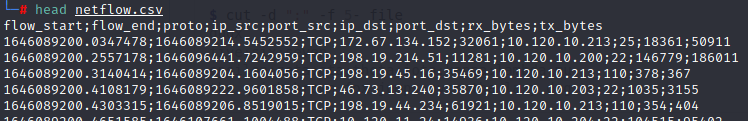
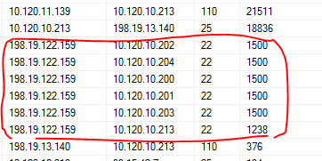
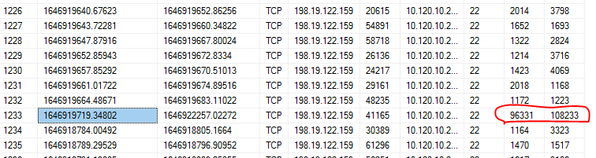
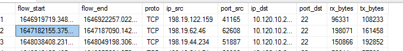
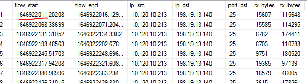

# SK-CERT - CHÝBAJÚCA ÚHRADA
> Riaditeľ firmy mal nečakaný telefonát od dodávateľa. Dodávateľ sa sťažuje, že im dlžia peniaze, ale podľa firmy je všetko v poriadku. Stala sa firma obeťou podvodu? Prikladáme vám sietové spojenia za posledný mesiac: https://drive.google.com/file/d/1uJweF9ns2lwNRdDzRnic1kiZUJZjqERi/view?usp=sharing
Reported Difficulty: 2

## 1 Útočník
> Stala sa firma obeťou nejakého kybernetického útoku? Aká je IP adresa, z ktorej ju útočník napadol? (flag je IP adresa)

Mame ~500MB csv subor na analyzovanie trafficu, ktory obsahuje info o flow start, flow end, source ip, destination ip a dalsie info ohladom traficu. 



Aj ked naazov suboru je `netflow` a takto nevedel som najst tool online ktory by to vedel zanalyzovat autmaticky... vyzera ze to nie je NewFlow format, kdo vie cim to vygenerovali. Takze skusim to zanalyzovat "manualne"... Excel nepomohol lebo nevedel nalodovat ~6M riadkov, bash tiez moc tu nepomoze, takze idem to nalodovat do SQL. Po importovani suboru do SQL, skusam vygenerovat agregatne data o komunikaci medzi jednotlivymi source a dst IP podla dst portu:

```
select ip_src,ip_dst,port_dst,COUNT(proto)  from netflow group by ip_src,ip_dst,port_dst order by COUNT(proto) desc
```

Zaujimavy traffic je z `198.19.122.159` na rozne privatne IPcky na destination port 22 (ssh). Vyzera to podozrivo ako skuska brute force login cez ssh:



Skusame tu IPecku ci to je falg a SUCCESS! Mame prvy flag.

```
flag:198.19.122.159
```

## 2 Prienik
> Útok bol úspešný a útočník urobil čosi zlé na serveri firmy. Aký je čas tohto spojenia? (flag je vo formáte unix timestamp zaokrúhlený nadol na celé sekundy)

Z predchadzajucej ulohy vidime ze utocnik z IP `198.19.122.159` skusal brute force login maximalne 1500 krat, takze pri tych 1238 pokusoch na sa mu asi podarolo preniknut do `10.120.10.213`. Pozrieme sa blizsie na tie pokusy ci vieme zistit ktory to bol ten uspesny, sql query ktou pouzijeme:

```
select * from netflow where ip_src = '198.19.122.159' and ip_dst = '10.120.10.213' and port_dst = '22'
```
Z vysledkov query vidime ze pri vacsine konekcii rx_bytes a tx_bytes su medzi 1000 a 5000 bytov, ale jeden vycnieva, ten bude asi successfull login... skusame odoslat `1646919719` ako flag a je to ono!



```
flag: 1646919719
```

## 3 Čo sa zmenilo?
> Útočník teda využil bruteforce útok na SSH a dostal sa na firemný server. Následne pripravil ďalšiu fázu útoku. Kedy je ním pripravenú zmenu možné pozorovať po prvý raz? (flag je vo formáte unix timestamp zaokrúhlený nadol na celé sekundy)

Vieme za sa utocnik dostal na `10.120.10.213`, dalej analyzujeme traffic z a do tohto servera a zistujeme:

* pravdepodobne je to mail server kedze vsetky incomming konekcie su na portoch 110 (POP3), 25 (SMTP) a 22 (SSH)
* vsetky konekcie z toho serveru su na port 25 (SMTP)
* server je vystaveny neustalemu port probingu

Kedze do servera nie je ziadna ina konekcia okrem ssh, smtp a pop3, predpoklad ze utocnik nechal nejaky backdoor sa nepotvrdila... backdor by pocuval na nejakom porte (npr. 4444). 

Tiez vidime ze server neinicioval ziadnu konekciu okrem smtp, takze ani predpoklad ze utocnik vyniesol data cez ssh smerom von sa nepotvrdila.

Skusame teoriu ze utocnik sa pripojil cez ssh z ineho severu:

```
select * from netflow where ip_dst = '10.120.10.213' and port_dst = '22' and tx_bytes > 10000
```
*tx_bytes > 10000 aby sme vylucili nesupesne pokusy ssh brute force*

Z tychto dat zistujeme ze pred utokom, ssh do toho serveru bolo iba z vnutornej siete `10.120.x.x` a po utoku vidime uspesne ssh konekcie z `198.19.x.x`.

Skusime teda vylucit `10.120.x.x` a mame:



Kedze je prvy timestamp je nas povodny utok, mozno je ten dalsi timestamp flag? Skusame odoslat `1647182155` a nic... nie je to flag. Takze nebude to ssh trafic, takze nam zostava pozriet sa na iny trafic... vieme ze jediny trafic odchadzajuci z `10.120.10.213` je smtp, pozrieme sa ci nejaky smtp traffic nesmeruje do `198.19.x.x`:

```
select flow_start, flow_end, ip_src, ip_dst,port_dst,rx_bytes,tx_bytes from netflow where ip_src = '10.120.10.213' and ip_dst like '198.19.%'
```

Z netflow logu vidime smtp traffic na `198.19.13.140` sa poprve vyskytuje 1646922011.20208 (Thursday, 10 March 2022 14:20:11.202) co z casoveho hladiska je po prvom prenikunuti do systemu 1646919719 (Thursday, 10 March 2022 13:41:59).
Skusame odoslat `1646922011` a mame uspech! Utocnik exfiltuje data cez smpt.



```
flag:1646922011
```

## 4 Aktivita
> Zdá sa, že útočník vynáša von všetky e-maily. Kam skutočne smeruje jeho útok? Ktorá IP adresa vo firme je jeho skutočným cieľom? (flag je IP adresa)

Toto sa mi nepodarilo zistit, azda su v tom logu vsetky IP. Ani jedna z `10.120.10.x` nebola flag. Chce to asi hlbsiu analyzu.

## 5 Ako to?
> Zamknuté Aktivita