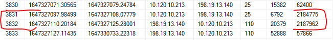

# SK-CERT - CHÝBAJÚCA ÚHRADA
> Riaditeľ firmy mal nečakaný telefonát od dodávateľa. Dodávateľ sa sťažuje, že im dlžia peniaze, ale podľa firmy je všetko v poriadku. Stala sa firma obeťou podvodu? Prikladáme vám sietové spojenia za posledný mesiac: https://drive.google.com/file/d/1uJweF9ns2lwNRdDzRnic1kiZUJZjqERi/view?usp=sharing
Reported Difficulty: 2

## 1 Útočník
> Stala sa firma obeťou nejakého kybernetického útoku? Aká je IP adresa, z ktorej ju útočník napadol? (flag je IP adresa)

> Body: 6

Máme ~500MB csv súbor na analyzovanie sieťového spojenia, ktorý obsahuje info o flow start, flow end, source ip, destination ip a ďalšie info ohľadom spojenia. 


Aj keď názov súboru je `netflow`, nevedel som nájsť nastroj ktorý by to vedel zanalyzovať automaticky... vyzerá, že to nie je NewFlow formát, kto vie čím to vygenerovali. Takže skúsim to zanalyzovať "manuálne"... Excel nepomohol lebo nevedel načítať ~6M riadkov, `bash/grep/sed` tiež moc tu nepomôže, takže idem to načítať do SQL. Po importovaní súboru do SQL, skúšam vygenerovať agregátne dáta o komunikácii medzi jednotlivými src a dst IP podlá dst portu:

```sql
select ip_src,ip_dst,port_dst,COUNT(proto)  from netflow group by ip_src,ip_dst,port_dst order by COUNT(proto) desc
```

Zaujímavý traffic je z `198.19.122.159` na rôzne privátne IP adresy na destination port 22 (ssh). Vyzerá to podozrivo ako skúška brute force login cez ssh:


Skúšame tú IP adresu či to je flag a SUCCESS! Máme prvý flag.

```
flag: 198.19.122.159
```

## 2 Prienik
> Útok bol úspešný a útočník urobil čosi zlé na serveri firmy. Aký je čas tohto spojenia? (flag je vo formáte unix timestamp zaokrúhlený nadol na celé sekundy)

> Body: 6

Z predchádzajúcej úlohy vidíme, že útočník z IP `198.19.122.159` skúšal brute force login maximálne 1500 krát, takže pri tých 1238 pokusoch sa mu asi podarilo preniknúť do `10.120.10.213`. Pozrieme sa bližšie na tie pokusy či vieme zistiť ktorý to bol ten úspešný, sql query ktorú použijeme:

```sql
select * from netflow where ip_src = '198.19.122.159' and ip_dst = '10.120.10.213' and port_dst = '22'
```
Z výsledkov query vidíme, že pri väčšine konfekcií rx_bytes a tx_bytes sú medzi 1000 a 5000 bytov, ale jeden vyčnieva, ten bude asi successfull login... skúšame odoslať `1646919719` ako flag a je to ono!


```
flag: 1646919719
```

## 3 Čo sa zmenilo?
> Útočník teda využil bruteforce útok na SSH a dostal sa na firemný server. Následne pripravil ďalšiu fázu útoku. Kedy je ním pripravenú zmenu možné pozorovať po prvý raz? (flag je vo formáte unix timestamp zaokrúhlený nadol na celé sekundy)

> Body: 6

Vieme, že sa útočník dostal na `10.120.10.213`, ďalej analyzujeme traffic z a do tohto serveru a zisťujeme:

* pravdepodobne je to mail server keďže všetky prichádzajúce spojenia sú na portoch 110 (POP3), 25 (SMTP) a 22 (SSH)
* všetky spojenia odchádzajúce z toho serveru sú na port 25 (SMTP)
* server je vystavený neustálemu port probingu

Keďže do serveru nie je žiadne iné spojenie okrem ssh, smtp a pop3, predpoklad, že útočník nechal nejaký backdoor sa nepotvrdila... backdor by počúval na nejakom porte (napr. 4444). 

Tiež vidíme, že server neinicioval žiadne spojenie okrem smtp, takže ani predpoklad, že útočník vyniesol dáta cez ssh smerom von sa nepotvrdila.

Skúšame teóriu, že útočník sa pripojil cez ssh z iného servera:

```sql
select * from netflow where ip_dst = '10.120.10.213' and port_dst = '22' and tx_bytes > 10000
```
*tx_bytes > 10000 aby sme vylúčili neúspešne pokusy ssh brute force*

Z týchto dát zisťujeme, že pred útokom, ssh do toho serveru bolo iba z vnútornej siete `10.120.x.x` a po útoku vidíme úspešne ssh spojenie z `198.19.x.x`.

Skúsime teda vylúčiť `10.120.x.x` a máme:


Keďže prvý timestamp je náš pôvodný útok, možno je ten ďalší timestamp flag? Skúšame odoslať `1647182155` a nič... nie je to flag. Takže nebude to ssh traffic, zostava nám pozrieť sa na iný traffic... vieme, že jediný traffic odchádzajúci z `10.120.10.213` je smtp, pozrieme sa či nejaký smtp traffic nesmeruje do `198.19.x.x`:

```sql
select flow_start, flow_end, ip_src, ip_dst, port_dst, rx_bytes,tx_bytes from netflow where ip_src = '10.120.10.213' and ip_dst like '198.19.%'
```

Z netflow logu vidíme, že smtp traffic na `198.19.13.140` sa po prvé vyskytuje 1646922011.20208 (Thursday, 10 March 2022 14:20:11.202) čo z časového hľadiska je po prvom preniknutí do systému 1646919719 (Thursday, 10 March 2022 13:41:59).
Skúšame odoslať `1646922011` a máme úspech! Útočník exfiltruje dáta cez smpt.


```
flag: 1646922011
```

## 4 Aktivita
> Zdá sa, že útočník vynáša von všetky e-maily. Kam skutočne smeruje jeho útok? Ktorá IP adresa vo firme je jeho skutočným cieľom? (flag je IP adresa)

> Body: 6

Toto sa mi nepodarilo zistiť, azda sú v tom logu všetky IP ale ani jedna z `10.120.10.x` nebola flag. Chce to asi hlbšiu analýzu.

*Ďalšie kroky boli pridané po súťaži na základe pomoci od iných súťažiacich ktorým patri vďaka!*

Keď sa pozrieme na smtp traffic tak útočník si z firemného mail serveru `10.120.10.213` posiela maily na svoj server `198.19.13.140`. Keďže tento scenár hovorí, že niektoré faktúry neboli uhradene, skúsime predpokladať, že útočník monitoroval mailovú komunikáciu a keď prišla požiadavka na úhradu faktúry od dodávateľa, tak ju zmanipuloval. Požijeme nasledovnú SQL query na zobrazenie komunikácie medzi dvoma mail severmi:

```sql
select flow_start, flow_end, ip_src, ip_dst, port_dst, rx_bytes,tx_bytes from netflow where  ip_src in ('10.120.10.213', '198.19.13.140') and ip_dst in ('10.120.10.213', '198.19.13.140') order by flow_start
```

Po skúmaní komunikácie, netrvalo dlho kým sme si všimli niečo nezvyčajne:



V okamihu keď prišiel mail, ktorý má najväčšiu veľkosť (predpokladaná faktúra od dodávateľa), tak nasleduje pop3 z útočníkovho servera na firemný mail server s podobnou veľkosťou - asi to bude ta zmanipulovaná faktúra.<br/>
Ďalej sa pozrieme na komunikáciu ktorá bezprostredne nasledovala, skúsime nájsť klienta ktorý ten zmanipulovaný mail stiahol cez pop3. Použijeme nasledovnú SQL query ktorá zobrazí traffic po timestamp `1647327125.28001` kde destination je firemný mail `10.120.10.213`, port `110` a ešte si pridáme podmienku na veľkosť `rx_bytes + 0 > '218400'`:

```sql
select flow_start, flow_end, ip_src, ip_dst, port_dst, rx_bytes,tx_bytes from netflow where  flow_start > 1647327125.28001 and ip_dst = '10.120.10.213' and port_dst = '110' and rx_bytes + 0 > '218400'
```


```
flag: 10.120.11.73
```

## 5 Ako to?
> Už je jasné, že útočník musel pozmeniť faktúru, ktorú dodávateľ zaslal do firmy. Účtovníčka si ju následne stiahla a platbu uhradila na nesprávny účet. Typický business email compromise. Ako je však možné, že sa na to tak dlho neprišlo? Zistite ako a uveďte počet bajtov prenesených v tom spojení, ktoré s touto aktivitou súvisí naposledy. Flag je počet bajtov (súčet rx a tx v danom spojení).    

> Body: 6