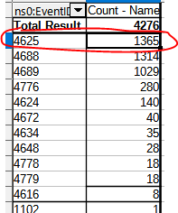
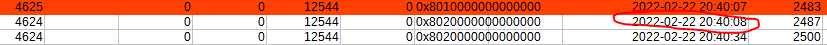
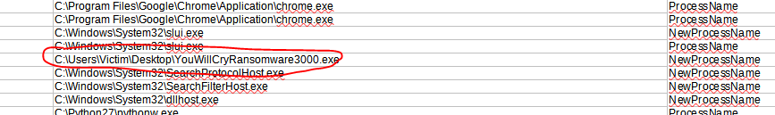
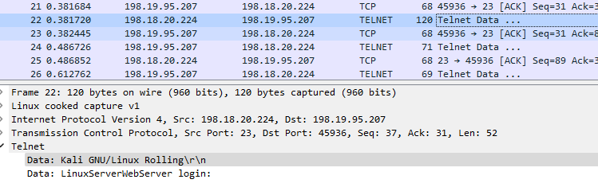
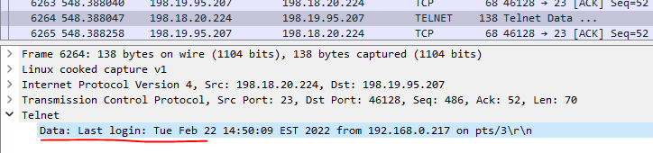
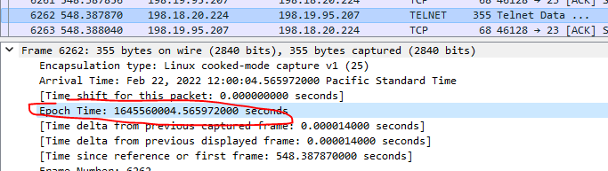
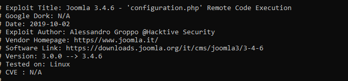

# SK-CERT - DÁTOVÁ ANALÝZA
> Ozvala sa nám spoločnosť, ktorá dostala hlásenie že majú infikovaný počítač ransomvérom. Ten je špecifický tým že posiela vygenerovaný privátny klúč na útočníkov server. Prikladáme vám pcap: https://drive.google.com/file/d/13arhVaKNFD_g2qCjuDBrECmpN6MKd4Rw/view?usp=sharing <br/>
Reported Difficulty: 1


## Kontrola
> Z dodaného PCAP súboru je potrebné zistiť či naozaj je spoločnosť infikovaná, a pokiaľ áno, tak je potrebné zistiť o aký privátny klúč sa odosiela. Vlajka je IP adresa serveru na ktorý sa klúč odoslal.

Musim uznat ze som to isiel skratkou a skusal rozne IPecky z komunikacie kym som nenatrafil na tu pravu: `194.182.66.53`

```
flag: 194.182.66.53
```

## Windows?
> Zdrojová IP počítača ktorý odosielal privátny klúč, patrí lokálnemu počítaču s windows. Je potrebné zistiť ako prenikli do tohto systému. Prikladáme bezpečnostný log v XML formáte.
https://drive.google.com/file/d/1pmJNCfgnpTCMewCaRioqagYj0_VLcold/view?usp=sharing
Vlajka je dátum a čas prvého prieniku (Formát Y-m-d H:i:s)

V tomto kroku mame securty log v xml, otvorime ho v LibreOffice Calc a pozrieme sa na rozne eventy co tam mame. Zo poctu roznych logov vidime vysoky vyskit 4625 co je Failed Login.



Ked si vyfiltrujeme vsetky 4625 eventy vidime ze vsetky maju FailureReason `%%2313` co je `Unknown user name or bad password. (529)`, targetuser je `victim` a zdrojom je `LinuxServerWebServer`. Vyzera to na bruteforce login ktory, ako predpokladame ze bol bol enty point, nas flag by mal byt prvy successfull login attempt po poslednom failed:



```
flag: 2022-02-22 20:40:08
```

## Ktorý proces?
> Po bruteforce útoku a prihlásení, útočník spustil malvér. Je potrebné zistiť meno procesu. Vlajka je meno procesu (Formát: meno_procesu.format)

V LibreOffice vyfiltrujeme vsetky eventy s ProcessName a NewProcessName a hladame nieco podozrive po case prveho successfull loginu utocnika a o chvilku to mame:



```
flag: YouWillCryRansomware3000.exe
```

## Otvorený test
> Kompromitovaný LinuxServerWebServer je náše testovacie prostredie, aplikácie na serveri sú dostupné iba z lokálnej siete, ale telnet server je otvorený do sveta. Prikladáme Pcap s potrebnými dátami. https://drive.google.com/file/d/1y3pOvG9PDGf7Sg7HtgOGvfjpk6qlVYor/view?usp=sharing
Vlajka je EpochTime prieniku do systému (bez milisekúnd).

Po otvoreni pcap suboru, poobzerame sa trosku okolo a uvidime ze sa niekdo snazi prihlasit cez telnet session:



Skusime hladat "Login" v paketoch s cielom najst prvy success login, a po niekolko desiatok klikoch narazame na "Last Login" message ktora sa objavuje po uspesnom prihlaseni sa.


Pre istotu pojdeme este zopar paketov vyssie aby sme sa uistili ze to bol utocnik ktory uhadol login a heslo. Po prezreti zopar desiatok paketov predtym vidime ze utocnik uhadol login `bob` a heslo `adminbob` a paket cislo `6262` mozeme povazovat ako okamih preiniku do systemu ktory ma EpochTime (bez milisekund)



```
flag: 1645560004
```

## Stará joomla
> Z logov sme zistili že útočník vyhackoval aj našu joomlu na testovacom serveri. Z posledného PCAP súboru je potrebné zistiť aký exploit útočník použil.
Vlajka je url odkial útočník exploit stiahol (Formát: www.stránka_exploitu.doména/cesta_k_exploitu)

Pri pozerani zopar dalsich paketov, vidime ze utocnik prve co spravil je `wget https://www.exploit-db.com/download/47465`, rychly nahlad do toho url nam potvrdzuje ze ide o Joomla expoit.



```
flag: www.exploit-db.com/download/47465
```


