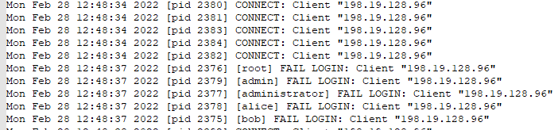
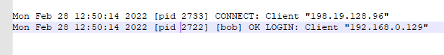

# SK-CERT - INITIAL: FTP SERVER
> Zákazník nás poprosil o analýzu logu z ftp servera ktorý niekto vyhackoval. Log najdete na: https://drive.google.com/file/d/1py6tEkkzk_2BnFgvqtby-8UVGbnxzE_P/view?usp=sharing <br/>
Reported Difficulty: 0

:exclamation: *Súbory a zadania z tejto súťaže môžete stiahnuť z https://ulozto.net/file/9qLDe5asaCHJ/*

## 1 Útočník
> Z akej IP adresy sa vykonal útok?
Formát vlajky: IP

> Body: 1

<details>
<summary>Zobraziť riešenie</summary>

Po otvorení logu a krátkom preskúmaní, vidíme veľa `CONNECT: Client` a `FAIL LOGIN` sprav poukazujúcich na IP adresu z ktorej sa konal útok.



```
flag: 198.19.128.96
```
</details>

## 2 Aký použivateľ
> Aký je správny použivateľ ftp serveru?
Format vlaky: použivateľ

> Body: 1

<details>
<summary>Zobraziť riešenie</summary>

Po odstránený všetkých riadkov obsahujúcich `FAIL LOGIN`, pozrieme čo nám zostalo:



```
flag: bob
```
</details>

## 3 Úspešný prienik
> O akom čase útočník úspešne prenikol do systému?
Formát vlajky: Y-m-d H:i:s

> Body: 1

<details>
<summary>Zobraziť riešenie</summary>

Hľadáme `OK LOGIN` z útočníkovej IP `198.19.128.96`


```
flag: 2022-02-28 12:53:10
```
</details>
