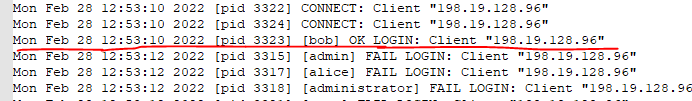

# SK-CERT - INITIAL: FTP SERVER
> Zákazník nás poprosil o analýzu logu z ftp servera ktorý niekto vyhackoval. Log najdete na: https://drive.google.com/file/d/1py6tEkkzk_2BnFgvqtby-8UVGbnxzE_P/view?usp=sharing <br/>
Reported Difficulty: 0

## 1 Útočník
> Z akej IP adresy sa vykonal útok?
Formát vlajky: IP

> Body: 1

Po otvoreni logu a kraktom preskumani, vidime vela `CONNECT: Client` a `FAIL LOGIN` sprav poukazujucich na IP adresu s ktorej sa konal utok.


```
flag: 198.19.128.96
```

## 2 Aký použivateľ
> Aký je správny použivateľ ftp serveru?
Format vlaky: použivateľ

> Body: 1

Po odstraneny vsetkych riakdov obsahujucich `FAIL LOGIN`, pozrieme co nam zostalo:


```
flag: bob
```

## 3 Úspešný prienik
> O akom čase útočník úspešne prenikol do systému?
Formát vlajky: Y-m-d H:i:s

> Body: 1

Hladame `OK LOGIN` z utocnikovej IP `198.19.128.96`



```
flag: 2022-02-28 12:53:10
```

