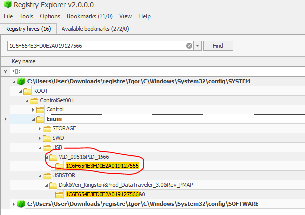
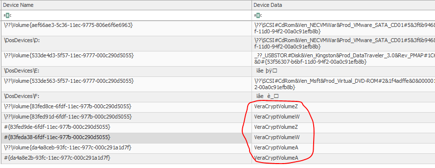
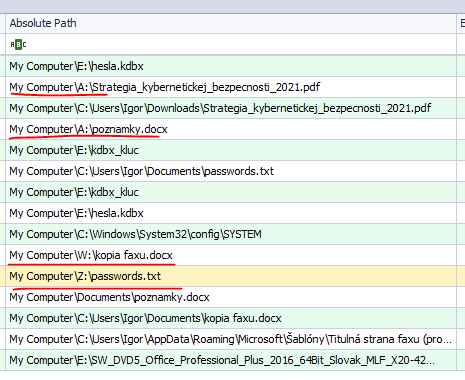
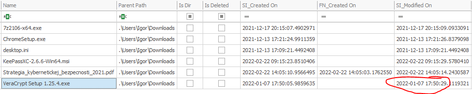
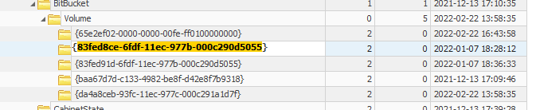
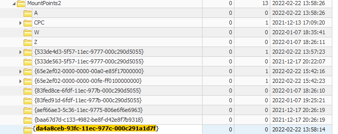
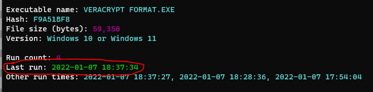
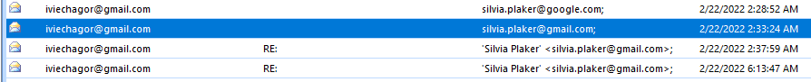

# SK-CERT - NEZNÁME USB
> Neregistrované USB so šifrovaným obsahom bolo nájdené v priestoroch firmy. Nakolko v minulosti sa preukázalo, že boli vynášané informácie prostredníctvom externým médií, vnútorná politika nedovoluje používanie neregistrovanych prenosových médií, je potrebné preveriť celú situáciu. Prvotné overovanie komunikáciou so zamestnancami neprinieslo žiadne ovocie a tak je nevyhnutné vykonať dôkladne hĺbkovú forenziu zariadenia.<br/>
Reported Difficulty: 2

:exclamation: *Súbory a zadania z tejto súťaže môžete stiahnuť z https://ulozto.net/file/9qLDe5asaCHJ/*

## 1 Identifikácia
> Nájdené zašifrované USB nemá vlastníka takže je potrebné postupne zistiť do ktorých počítačoch bolo USB pripojené. Máte k dispozícii ‘registry hives’ z každého počítača na oddelení a hľadajte na základe daného sériového čísla USB: 1C6F654E3FD0E2A019127566.
https://drive.google.com/file/d/10fj5CzVbMdXhpZzbW-SipU1DJZjd1VN1/view?usp=sharing
Odpoveď uveďte vo formáte computer-name_USB-VID_USB-PID a ak ich bude viac, odpovede oddeľte čiarkou.

> Body: 6

Po prestudovani co to je za obsah, zistujeme ze je to [Kroll Artifact Parser and Extractor (KAPE)](https://www.kroll.com/en/insights/publications/cyber/kroll-artifact-parser-extractor-kape). Dalsie studovanie nas priviedlo [Registry Explorer](https://f001.backblazeb2.com/file/EricZimmermanTools/net6/RegistryExplorer.zip) do ktoreho sme nalodovali exportnute registry a jednoduchim find sme hladali USB ID `1C6F654E3FD0E2A019127566`. Jediny zaznam bol najdeni v pocitaci `DESKTOP-J3G0A8R` uzivatela `Igor`:



```
flag: DESKTOP-J3G0A8R_0951_1666
```

## 2 Pripojené média
> Používateľ zisteného zariadenia sa volá Igor.
Prikladáme triage image: https://drive.google.com/file/d/1ITBlhf7ZYGIi9HNlmfilujZao5Mqv7Lb/view?usp=sharing
Uveďte všetky písmená pod ktorými bolo USB pripojené do Igorovho počítača v čase keď už bolo zašifrované. Odpoveď uveďte v abecednom poradí e.g. P,Q,R,S

> Body: 6

V tomto sme dlho hrabali, hladali cez Registry Explorer, USBDriveLog, kym sme si nevsimli pod `SYSTEM\MountedDevices` kluce s `VeraCryptVolume` hodnotami, a potom len spravne usporiadat pismena podla abecedy. 



Najprv som skusil `W,Z`, lebo som myslel ze je to ten DataTraveler kluc kedze oba volumes boli `\??\Volume{83fed91d-6fdf-11ec-977b-000c290d5055`- nepreslo, potom som skusil iba `A` - tiez neslo, tak potom len zostalo:

```
flag: A,W,Z
```

## 3 Vynesené súbory
> Nájdite súbory vynesené prost. USB. Treba uviesť všetky súbory ktoré existujú/existovali na USB. Uveďte názvy súborov v abecednom poradí e.g. abc.te,bbc.lr,zzz.txt

> Body: 6

Pouzitim Eric Zimmermanovho [JumpList Explorer](https://f001.backblazeb2.com/file/EricZimmermanTools/net6/JumpListExplorer.zip) sme si nalodovali Igorove `JumpLists` z `` a mame subory ktore boli na diskoch A, W a Z:



*Poznamka pre buduceho mna: davat pozor na `Sort Lines Lexicographically Ascending` ktore berie do uvahy case, co ma stalo desiatky nesupesnych pokusov a zopar stratenych dni.* 

```
flag: kopia faxu.docx,passwords.txt,poznamky.docx,Strategia_kybernetickej_bezpecnosti_2021.pdf
```

## 4 Šifrovanie
> Prehliadnutie Igorovho zariadenia odhalilo, že išlo aj o súbory, ktoré v najlepšom prípade existujú len na USB. Ako prvý krok je potrebné zistiť použitý spôsob (softvér) šifrovania. Hľadajte vo všetkých dostupných artefaktoch. Kedy bol taký šifrovací softvér stiahnutý? Odpoveď uveďte vo formáte Y-m-d H:i:s a v UTC timezone.

> Body: 6

Vieme ze pouzity sifrovaci software bol VeraCrypt, a odpoved kedy bol stiahnuty skusime najst `Downloads` adresar pre uzivatela Igor. Ten sa ale nenachadza v image disku, ale mame tam $MFT (Windows Master File Table) v ktorom skusime najst metadata z C:\ disku.
Pouzijeme [MFTExplorer](https://f001.backblazeb2.com/file/EricZimmermanTools/net6/MFTExplorer.zip) a najdeme subor `VeraCrypt Setup 1.25.4.exe` v `C:\Users\Igor\Downloads` kde `Modified On` je cas ked bol subor stiahnuty:



```
flag: 2022-01-07 17:50:29
```

## 5 Veracrypt
> Teraz keď vieme že ide o veracrypt, môžeme nahliadnuť do inych artefaktov a zamerať sa na podmnožinu informácií. Kedy bolo naposledy veracryptom formátované USB? Odpoveď uveďte vo formáte Y-m-d H:i:s

> Body: 6

Vacisnu info o VeraCrypt artefaktoch sme cerpali z http://web.archive.org/web/20201204131937/https://sparky.tech/tracking-encryption-part-1-veracrypt-usage/

Najprv skusame `last write timestamps` klucov pod `SOFTWARE\Microsoft\Windows\CurrentVersion\Explorer\BitBucket\Volume` co by malo predstavovat kedy naposledy bol VeraCrypt volume vytvoreny:



Ani jeden z tych timestampov nebol spravny flag.

Dalej skusame `last write timestamp` klucov pod `SOFTWARE\Microsoft\Windows\CurrentVersion\Explorer\MountPoints2` ale ani jeden nebol akceptovany.



Ani `2022-02-22 13:57:09` co je `Execution Time` pre ` ControlSet001\Services\bam\State\UserSettings\S-1-5-21-1205748010-4293533567-3470189221-1001\Device\HarddiskVolume3\Program Files\VeraCrypt\VeraCrypt.exe`

Zufalstvo... ideme spat na zaciatok, citame znovu clanok `veractypt usage` uvedeny na zaciatku a pozerame `Prefetch | If enabled, Prefetch will contain evidence of VeraCrypt usage`... z triage image vidime ze mame subor `E:\C\Windows\prefetch` a je to jedine co sme este neskusili. Rychle googlenie a zistujeme ze v `Prefetch` sa nachadzaju timestampy a ine informacie ktore Windows uklada pri spustani suborov - zeby to bolo ono? Nahazame znovu tool na parsovanie tychto suborov v Ericovej zbierke [PECmd](https://f001.backblazeb2.com/file/EricZimmermanTools/net6/PECmd.zip), spustame tool pomocou prikazu: 
```
.\PECmd.exe -f "E:\C\Windows\prefetch\VERACRYPT FORMAT.EXE-F9A51BF8.pf"
```
a mame konecne spavny timestamp:



```
flag: 2022-01-07 18:37:34
```

## 6 Mail
> Počas prehliadania prefetch súborov ste mohli naraziť aj na dôkaz vykonávania OUTLOOK.EXE. Zistite posledné informácie z mailovej komunikácie. Uveďte s kým Igor komunikoval. Odpoveď uveďte ako mailovú adresu v bežnom formáte e.g. sk-cert@cybergame.sk

> Body: 6

Tento flag bol len uz ceresnickou na torte, jednoducho sme otvorili Outlook offline data file `iviechagor@gmail.com.ost` z tirage image ktory sa nachazal v `E:\C\Users\Igor\AppData\Local\Microsoft\Outlook` a zistili s kym komunikoval:



```
flag: silvia.plaker@gmail.com
```


