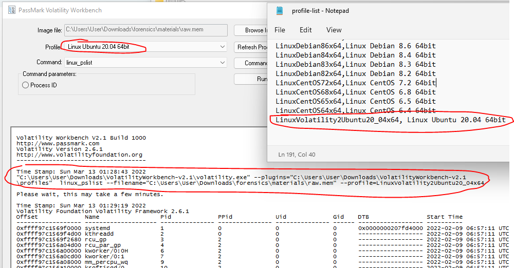
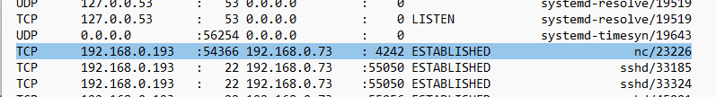
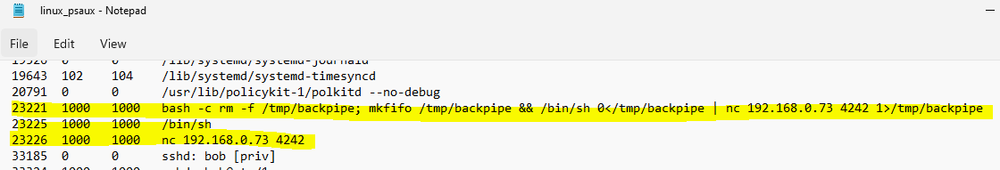
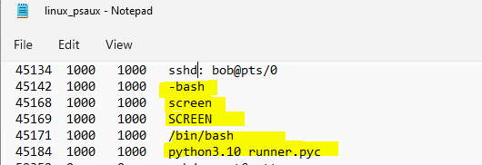
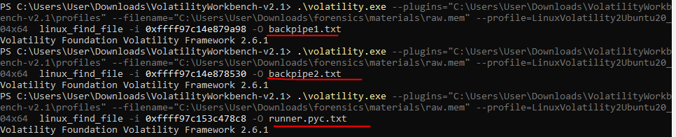
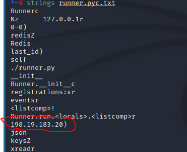
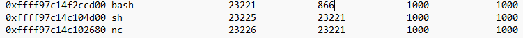
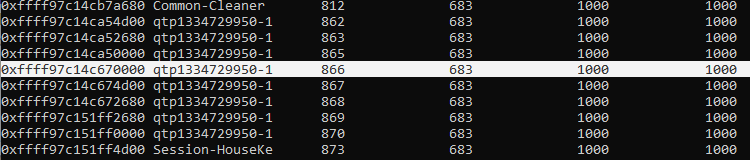

# SK-CERT - UNIKNUTÁ ŠTATISTIKA
> Na internete sa objavil únik osobných údajov ľudí ktorý sa zapojili do štatistiky na očkovanie. Tieto údaje zhromažďovala firma tretej strany a poskytla nám obraz pamäte. https://drive.google.com/file/d/1Lml12MPMF5vV3c91E8Cjx9T7JMlZod12/view?usp=sharing
K obrazu pripájame aj volatility2 a volatility3 profily. </br>
Reported Difficulty: 3

:exclamation: *Súbory a zadania z tejto súťaže môžete stiahnuť z https://ulozto.net/file/9qLDe5asaCHJ/*

## 1 Čo a kam?	
> Je potrebné zistiť aký proces vyniesol údaje, a na akú IP adresu boli údaje odoslané.
Vlajka je PID a IP adresa (Formát: PID_IP)

> Body: 9

Toto je moja prva analyza memory dumpu, takze toto urcite nie je ukazka ako sa to robi ale skor moja cesta ucenia sa.

Najprv som stiahol [Volatility Workbench](https://www.osforensics.com/tools/volatility-workbench.html) a zoznamil sa s toolom, trosku googlenia a som pochopil ze najprv musim zistit s akym typom dumpu pracujem aby ho tool vedel rozpoznat a spravne s nim pracovat. Trvalo mi chvilku kym som pochopil ze prilozeny subor `Volatility2Ubuntu20_04.zip` je profil pre Volatility ktory treba pouzit aby vedel rozpoznat typ dumpu. Po skopirovani profilu do `profiles` adresara, pridani profilu do `profile-list.txt` som uspesne zacal analyzovat memory dump:



*Po nejakom case som zacal pouzivat PowerShell namiesto GUI lebo bolo jednoduchsie ukladat vysledny do .txt na dalsiu analyzu.*

Potom nasledovaly hodiny trapenia sa, hladania nejakych tutorialov, writeupov kde je ukazka analyzi Linux memory dumpu, dva zdroje ktore ma uviedli na spravnu cestu su:
* https://stuxnet999.github.io/dfir/2020/09/20/Linux-Memory-Forensics.html
* https://stuxnet999.github.io/insomnihack/2020/09/17/Insomihack-getdents.html

Postupne som vytiahol `linux_ifconfig`, `linux_netstat`, `linux_pslist`, `linux_psaux`, `linux_pstree` a `linux_bash`.

Nasledovne boli zaujimave zistenia:
* Network connection na `192.168.0.73` port `4242` cez `nc` (samozrejme toto nebol spravny flag)
  
* Zjavne kanal na exfiltraciu udajov zisteny z `linux_psaux`
  
* Tiez zaujimave vyzerali tieto procesy, pustene rovnakym uzerom (uid:1000) ako ten backpipe hore
  

V tomto bode som sa sustredil na hlbsie hladanie co vlasne user uid:1000 robil s tym pythonom a snazil som sa cez `linux_procdump` a `strings` zistit viac info. 
```
.\volatility.exe --plugins="C:\Users\User\Downloads\VolatilityWorkbench-v2.1\profiles" --filename="C:\Users\User\Downloads\forensics\materials\raw.mem" --profile=LinuxVolatility2Ubuntu20_04x64 linux_procdump -p 23221 -D .
```
Asi som spravil memory dump kazdeho z horeuvedenych process id, ale nic som tam nenasiel.

Potom som skusil vytiahnut niektore zo suborov z pamati ako `/tmp/backpipe`, a `runner.pyc`. 



Ten `runner.pyc` konecne priniesol ovocie, bola tam IP addressa na ktoru utocnik exfiltroval data:



```
flag: 45184_198.19.183.20
```

## 2 Zranitelnosť
> Je potrebné zistiť ako útočník prenikol do systému.
Vlajka je CVE identifikátor zranitelnosti.

> Body: 9

Pozrieme sa na process `23221` z ktoreho utocnik zacal exfiltracu, videme ze jeho parent process je `866` ale nie je vobec v zozname aktivnych procesov.



Skusame komandu `linux_pidhashtable` ci nam mozno ukaze viac:



Zistujeme ze process id `683` patri procesu `supervisord`, rychle hladanie CVE patriace tomtu produktu nam neprinasaju ovocie, ani jedna z dvoch zdranitelnosti (	CVE-2017-11610, CVE-2019-12105) nie je nasou vlajkou.

Zostavame tu asi zaseknuty....

## 3 Payload
> Zamknuté Zranitelnosť

> Body: 9

## 4 Eskalácia
> Zamknuté Payload

> Body: 9

## Perzistencia
> Zamknuté Eskalácia

> Body: 9
