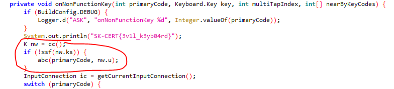
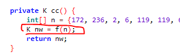
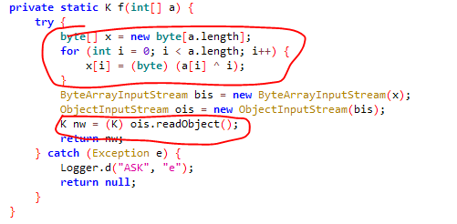
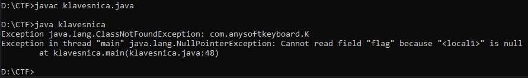
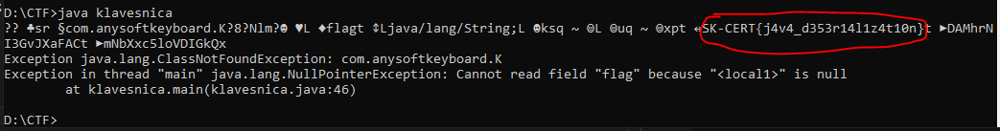
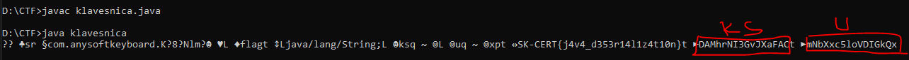
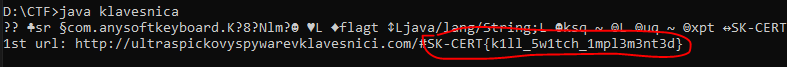
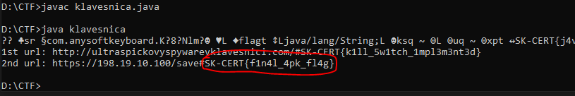

# SK-CERT - KLÁVESNICA
> Zachytili sme šíriace sa APK,  ktoré údajne obsahuje keylogger. Prikladáme vám spomínané APK a je potrebné nad ním spraviť analýzu. Link: https://drive.google.com/file/d/1lAPNcaxAd9tzCCfszW09dzxby6621XzW/view?usp=sharing <br/>
Reported Difficulty: 2

:exclamation: *Súbory a zadania z tejto súťaže môžete stiahnuť z https://ulozto.net/file/9qLDe5asaCHJ/*

## 1 Podozrivé APK
> Vieme skontrolovať funkcionalitu a zistiť či aplikácia má nejaké indikátory o spomínanom probléme?

> Body: 6

<details>
<summary>Zobraziť riešenie</summary>

Stiahneme podozrivé apk, otvoríme a ľubovoľnom IDE prostredí a hľadáme flag "SK-CERT" a hneď ho aj máme:


```
SK-CERT{3v1l_k3yb04rd}
```
</details>

## 2 Funkcionalita
> APK obsahuje viacero podozrivých funkcii, viete sa na to pozrieť bližšie?

> Body: 6

<details>
<summary>Zobraziť riešenie</summary>

Pri tejto úlohe som použil tool `jadx-gui-1.3.4-with-jre-win.zip` z https://github.com/skylot/jadx na prezeranie zdrojového Java kódu.<br/>
Po niekoľkých chvíľach prezerania kódu, nachádzame zaujímavú časť v `com.anysoftkeyboard.AnySoftKeyboard` vo funkcii `onNonFunctionKey`:



Vidíme tam tri zaujímavé funkcie: `cc()`, `xsf()` a `abc()` a triedu `class K` v ktorej je atribút `flag`:

```java
class K implements Serializable {
    public String flag;
    public String ks;
    public String u;

    K() {
    }
}
```

Pri ďalšom študovaní uvedených funkcii, vidíme, že funkcia `cc()` inicializuje objekt triedy `K` cez ďalšiu funkciu `f()`:



Funkcia `f()` potom cez manipuláciu a deserializáciu poľa bajtov vytvorí náš objekt.



Teraz sa len musíme dostáť k hodnotám objektu `nw` triedy `K`... Cez víkend som skúšal debug apk cez Android Studio ale sa mi nepodarilo rozbehať debugger. Podarilo sa mi nainštalovať apk do emulátora ale debug sa nepodaril. Cez `adb logcat` sa tiež nič neukázalo. 

Ďalší postup, ktorý som vlastne najprv myslel, že je ťažšia cesta ale dobrí anjeli z discordu ma usvedčili, že nie je tak ťažká, tak som skúsil vytvoriť tie funkcie vo vlastnom Java kóde a skúsil či sa mi podarí deserializovať ten objekt `K`. Vytiahol som tie zaujímavé funkcie do nasledovného Java kódu ( `klavesnica.java` ):

```java
import java.io.Serializable;
import java.io.ByteArrayInputStream;
import java.io.DataOutputStream;
import java.io.ObjectInputStream;
import java.util.Arrays;

class K implements Serializable {
    public String flag;
    public String ks;
    public String u;

    K() {
    }
}
class klavesnica {
    
    public static K cc() {
        int[] n = {172, 236, 2, 6, 119, 119, 6, 18, 107, 102, 103, 37, 109, 99, 119, 124, 127, 119, 102, 120, 113, 108, 116, 120, 121, 107, 126, 53, 87, 189, 38, 239, 110, 38, 78, 78, 152, 39, 38, 36, 100, 41, 46, 77, 64, 76, 73, 91, 48, 35, 126, 89, 85, 67, 87, 24, 84, 88, 84, 92, 19, 110, 74, 77, 41, 47, 37, 120, 8, 69, 68, 44, 59, 56, 74, 53, 76, 76, 2, 79, 81, 36, 35, 83, 42, 85, 87, 47, 40, 45, 90, 70, 15, 22, 115, 28, 37, 51, 54, 24, 14, 81, 16, 83, 55, 13, 89, 94, 95, 31, 95, 91, 28, 64, 8, 71, 0, 68, 70, 25, 5, 13, 122, 107, 56, 60, 51, 23, 242, 207, 203, 176, 195, 243, 204, 223, 233, 207, 203, 200, 248, 141, 158, 226, 222, 243, 202, 235, 247, 160, 250, 248, 206, 221, 211, 220, 247, 204, 230};
        K nw = f(n);
        return nw;
    }
    private static K f(int[] a) {
        try {
            byte[] x = new byte[a.length];
            for (int i = 0; i < a.length; i++) {
                x[i] = (byte) (a[i] ^ i);
                
            }
            
            ByteArrayInputStream bis = new ByteArrayInputStream(x);
            ObjectInputStream ois = new ObjectInputStream(bis);
            System.out.println("String data: " + ois.readObject());
            K nw = (K) ois.readObject();
            return nw;
        } catch (Exception e) {
            System.out.println("Exception " + e);
            return null;
        }
    }

    public static void main(String[] args) {
        K nw = cc();    
        System.out.println("flag" + nw.flag); 
    }
}

```
Po skompilovaní a vykonaní kódu nám to vypľuje `Exception java.lang.ClassNotFoundException: com.anysoftkeyboard.K`. 



Dlho som sa snažil ako deserializovať pole bajtov do výsledného objektu, kým som nepochopil, že objekt musí byť deserializovaný v rovnakej štruktúre ako bol serializovaný a musel by som vytvoriť triedu `anysoftkeyboard`, čo bolo už mimo mojich schopnosti.</br>
Nakoniec ma napadlo iba vypísať ten byte array po for loope, pred tým ako sa načíta do ByteArrayInputStream. Pridal som nasledovný kód po for loope:

```java
String string = new String(x);
System.out.println(string);
```

A dostal ďalší flag:



```
flag: SK-CERT{j4v4_d353r14l1z4t10n}
```
</details>

## 3 Kľúče
> Vďaka analýze deserializácie ste sa dostali ďalej. Aké ďalšie veci viete získať?

> Body: 6

<details>
<summary>Zobraziť riešenie</summary>

V predchádzajúcej úlohe sme deserializáciou dostali nie len flag ale aj atribúty `ks` a `u` objektu `nw`, ktorý sa používa v ďalších dvoch funkciách `xsf()` a `abc()`.



Skúsime najprv rozlúštiť funkciu `xsf()`. Pri analýze vidíme, že v podstate treba len zistiť `url`, nie je podstatne či je to platné URL a či sa vôbec spojenie uskutočni alebo nie. Tak si funkciu trošku upravíme aby sme dostali ten `url`:

```java
private static boolean xsf(String nks) {
    int[] ks_e = {44, 53, 57, 24, 72, 97, 102, 70, 43, 2, 56, 57, 18, 54, 40, 32, 47, 46, 59, 17, 1, 62, 48, 68, 38, 4, 47, 46, 10, 42, 32, 53, 33, 50, 35, 1, 17, 39, 103, 80, 40, 27, 101, 123, 50, 13, 108, 0, 1, 19, 25, 19, 25, 127, 37, 95, 24, 67, 61, 105, 21, 37, 41, 28, 117, 44, 61, 4, 65, 35, 122, 93, 51, 69, 46, 37};
    int[] ks = x(ks_e, r(nks));
    String ks_s = new String();
    for (int i = 0; i < ks.length; i++) {
        ks_s = ks_s + ((char) ks[i]);
    }
    String url = ks_s;
    System.out.println("1st url: " + url);
    return false;
}
```

Samozrejme pridali sme aj tie ďalšie pomocné funkcie `x()` a `r()` a vykonali sme našu funkciu s parametrom `DAMhrNI3GvJXaFAC`:

```java
xsf("DAMhrNI3GvJXaFAC");
```

*Všetok kód som pridával do už existujúceho klavesnica.java súboru, ktorý som vytvoril v predchádzajúcej úlohe a púšťal som to ako celok.*

Po vykonaní kódu máme ďalší flag:



```
flag: SK-CERT{k1ll_5w1tch_1mpl3m3nt3d}
```
</details>

## 4 Finalizácia
> Vyzerá to tak, že aplikácia obsahuje “killswitch”. Teraz je potrebné zistiť kam posieľa data.

> Body: 6

<details>
<summary>Zobraziť riešenie</summary>

V tejto úlohe postupujeme podobne ako pri predchádzajúcej, analyzujeme funkciu `abc()` vidíme, že tam ten argument `key` a `if buffer.size() > 20` je iba návnada a môžeme to vyhodiť, zostava nám iba tento kód:

```java
private static void abc(String nu) {

    int[] u_e = {5, 58, 22, 40, 11, 89, 26, 67, 94, 111, 124, 103, 118, 82, 127, 73, 93, 96, 83, 104, 72, 76, 70, 13, 25, 51, 103, 26, 12, 70, 18, 61, 63, 26, 25, 62, 73, 13, 1, 0, 48, 98, 52, 34, 24, 13, 61, 76, 10, 51};
    int[] u = x(u_e, r(nu));
    String u_s = new String();
    for (int i = 0; i < u.length; i++) {
        u_s = u_s + ((char) u[i]);
    }
    System.out.println("2nd url: " + u_s);
}
```
Po vykonaní funkcie s parametrom `mNbXxc5loVDIGkQx`:

```java
abc("mNbXxc5loVDIGkQx");
```

máme finálny flag:



```
flag: SK-CERT{f1n4l_4pk_fl4g}
```
</details>


