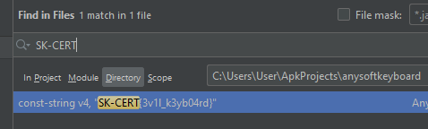

# SK-CERT - KLÁVESNICA
> Zachytili sme šíriace sa APK,  ktoré údajne obsahuje keylogger. Prikladáme vám spomínané APK a je potrebné nad ním spraviť analýzu. Link: https://drive.google.com/file/d/1lAPNcaxAd9tzCCfszW09dzxby6621XzW/view?usp=sharing  
Reported Difficulty: 2

## 1 Podozrivé APK
> Vieme skontrolovať funkcionalitu a zistiť či aplikácia má nejaké indikátory o spomínanom probléme?

Stiahneme podozrive apk, otvorime a lubololnom apk analyzatore a hladame flag "SK-CERT" a hned ho aj mame: `SK-CERT{3v1l_k3yb04rd}`

## 2 Funkcionalita
> APK obsahuje viacero podozrivých funkcii, viete sa na to pozrieť bližšie?

## 3 Kľúče
> Zamknuté Funkcionalita

## 4 Finalizácia
> Zamknuté Kľúče

