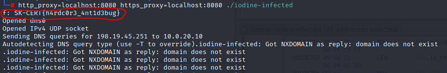
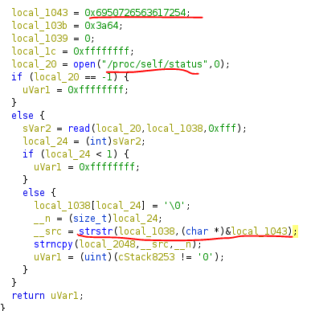

# SK-CERT - NEBEZPEČNÝ MALVÉR
>Externá firma nás informovala o výskyte nového linuxového malvéru. Malvér údajne umožňuje vzdialený prístup do siete a vykonáva útoky s finančným dopadom. Firma dokázala zistiť že za tým je tento súbor (heslo do zipu je cybergame2022): https://drive.google.com/file/d/1ImyJIMRkNw47h0M45CKgxT3byDzZ0slz/view?usp=sharing
a požiadali nás o analýzu. <br/>
Reported Difficulty: 3

## Kill switch
> Je možné malvér deaktivovať?

Zo stihnuteho suboru mame file `iodine-infected` a pomocou `file iodine-infected` zistujeme ze je to Linux ELF 64-bit executable, `strings` nam ziadny flag nenasiel. Virustotal nic neudava.
Google nam hovori ze `iodine` je software ktory umoznuje tunelovat IPv4 data cez DNS server. 
Po spusteni suboru, vidime ze sa deje nejaky DNS query:


Skusme pozriet pomocou Wiresharku co sa deje na sieti ked pustime tento subor este raz a jeden z DNS query prikazov nam odhalil ~~prvy~~ flag:


Toto ale nie je prvy flag! Fuck... 

Ideme skusit tazsiu cestu, skusit debug a pozriet sa co nam nieco kod neodhali. Otvaram binarku v [GHIDRA debuggeri](https://ghidra-sre.org/), aj ked netusim ako to vsetko funguje, ale dufam ze nieco tam uvidim :).

Po nejakom case pozerania, nasledovna funkcia mi padla do oka:


Neviem to ani vysvetlit (co hovori ako som na tom zle) ale som prisiel na to ak sa mi podari aby `curl https://lnjkabnsklmjgfkdjbngsbnsdreotijp.sghb` fungovalo, teda vratilo `0`, vypluje mi to flag.. dufam...

Problem ako donutit aby curl vratilo `0` som vyriesil pridanim `lnjkabnsklmjgfkdjbngsbnsdreotijp.sghb` do mojho DNSka, a potom este som nastartoval Burp local proxy a pridal jeho certifikat to Trusted root... a vyslo to:



```
flag: SK-CERT{h4rdc0r3_4nt1d3bug}
```

## Inject
>Je potrebné zistiť ako malvér vykonáva svoju ďalšiu fázu.

Ak pouzijeme [gdb](https://man7.org/linux/man-pages/man1/gdb.1.html) na debugovanie, vidme ze su tam nejake antidebug kontroly:


Z kodu vidim ze je tam funkcia ktora checkuje `/proc/self/status` a pri trosku googlenia vyzera ze je to [technika](https://programmer.ink/think/linux-anti-debugging-notes.html) ktora zistuje ci je pritomny `TracerPid` ktory je `non-0` pri debugovani.



Tu moja snaha asi konci... debuging je nieco co sa definitivne musim naucit. 

## Zadné vrátka	
>Ako sa útočníci dotanú do siete?

Tu som skusil pouzit flag co som naisle pri mojom prvom pokuse pri hladani riesenia prvej ulohy, a zobralo to.

```
flag: SK-CERT{dn5_3ncryp70r}
```