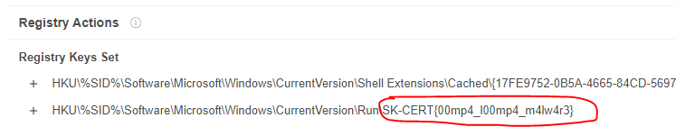

# SK-CERT - OOMPALOOMPA MALVÉR
> Dostali sme hlásenie, že sa rozšíril nový malvér zameraný na windows. Viete zistiť čo malvér spôsobuje? https://drive.google.com/file/d/1bln5pafds06iKWNW6Qvj-2HeYIioTBuP/view?usp=sharing <br/>
Reported Difficulty: 2

:exclamation: *Súbory a zadania z tejto súťaže môžete stiahnuť z https://ulozto.net/file/9qLDe5asaCHJ/*

## 1 Prvé zmeny
> Čo malvér vykonáva v prvých krokoch spustenia?

> Body: 6

Veľa skúsenosti s malvérovou analýzou nemám tak som skúšal rôzne online analyzátory a sandboxy, z ktorých prvý flag som našiel pomocou https://www.virustotal.com/ v [Registry Actions](https://www.virustotal.com/gui/file/62b1327647a984698242c8ef7cbd8502cc5ba8f5e2a8bd5975104c8bec2ec519/behavior/Microsoft%20Sysinternals)




```
flag: SK-CERT{00mp4_l00mp4_m4lw4r3}
```

## 2 Funkcionalita
>  Za akých okolností sa spustí ďalšia funkcionalita malvéru, a čo vykoná?

> Body: 6

## 3 Inject
> Zamknuté Funkcionalita

> Body: 6

## 4 Prvá časť
> Zamknuté Inject

> Body: 6

## 5 Druhá časť
> Zamknuté Prvá časť

> Body: 6