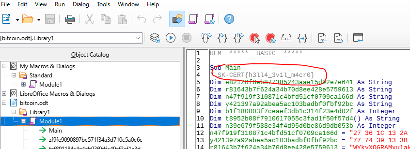
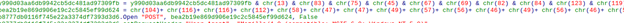
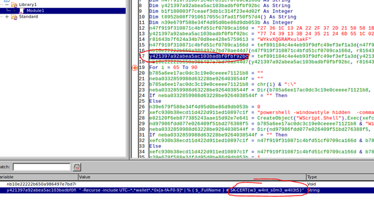
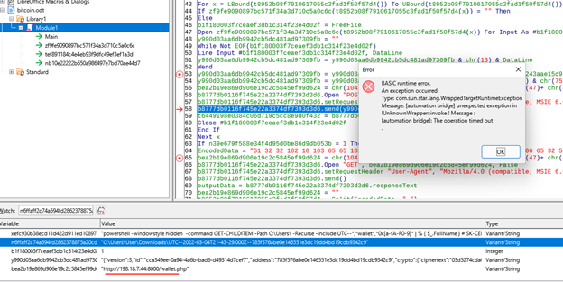
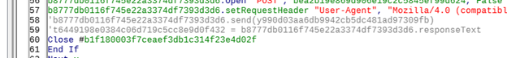
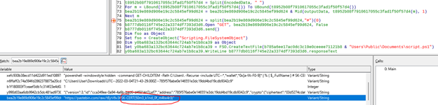
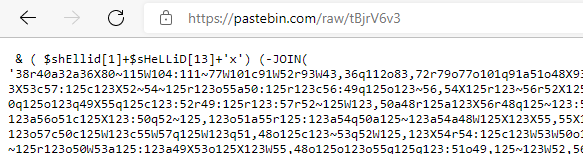
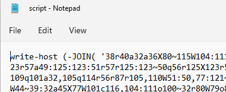
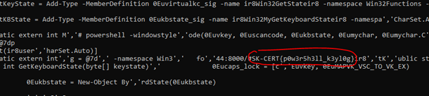

# SK-CERT - STRATENÉ KRYPTO
> Dostali sme hlásenia, že niektorým ľuďom zmizli kryptomeny. Jediná podobnosť medzi týmito hláseniami je tento dokument (Heslo do zip je cybergame2022): https://drive.google.com/file/d/1JxTfveNIuUPP3IPG8xf_sk0oIUX5Tma_/view?usp=sharing <br/>
Reported Difficulty: 1

:exclamation: *Súbory a zadania z tejto súťaže môžete stiahnuť z https://ulozto.net/file/9qLDe5asaCHJ/*

## 1 ODT
> Je potrebné zistiť či tento dokument obsahuje niečo zaujímavé

> Body: 3

<details>
<summary>Zobraziť riešenie</summary>

Z priloženého odkazu sa nám stiahne `documents.zip` v ktorom je súbor `bitcoin.odt`, zistime že je to OpenOffice dokument, a ako to býva v týchto hrách, asi to bude nejaké škodlivé makro. Takže po nainštalovaní LibreOffice a povolení makrá, otvárame bitcoin.odt a hneď máme upozornenie, že makrá môžu obsahovať vírus. Po otvorení makra, získavame náš prvý flag:



```
flag: SK-CERT{h3ll4_3v1l_m4cr0}
```
</details>

## 2 Čo spúšťame?
> Vyzerá to tak, že makro spúšťa nejaký ďalší program, je potrebné zistiť aký.

> Body: 3

<details>
<summary>Zobraziť riešenie</summary>

Hľadanie ďalšieho flagu bolo trošku zamotané, keďže prvé podozrivé miesto po dekódovaní [ASCII](https://testguild.com/qtp-ascii-chr-code-chart/) odhalilo flag `SK-CERT{wh3re_my_crypt0_g03s}`, ale to nebol ten správny.



Po dlhšom pátraní, sme sa dostali na debug funkcií, ktoré boli na začiatku kódu, a po ich sledovaní pri debugovani sme našli ďalší flag ktorý už bol správny:



```
flag: SK-CERT{w3_w4nt_s0m3_w4kk3t5}
```
</details>

## 3 Čo ďalej?
> Zistite kam sa posielaju ukradnuté kryptopenaženky.

> Body: 3

<details>
<summary>Zobraziť riešenie</summary>

Tak tu sme hneď skúsili flag `SK-CERT{wh3re_my_crypt0_g03s}` ktorý sme našli v predchádzajúcom kroku pri dekódovaní podozrivého ASCII reťazca:

```
chr(13) & chr(83) & chr(75) & chr(45) & chr(67) & chr(69) & chr(82) & chr(84) & chr(123) & chr(119) & chr(104) & chr(51) & chr(114) & chr(101) & chr(95) & chr(109) & chr(121) & chr(95) & chr(99) & chr(114) & chr(121) & chr(112) & chr(116) & chr(48) & chr(95) & chr(103) & chr(48) & chr(51) & chr(115) & chr(125)
```
```
flag: SK-CERT{wh3re_my_crypt0_g03s}
```
</details>

## 4 Skládačka
> Zistili sme kam sa odosielajú kryptopenaženky. Skúste zistiť ako funguje malvér v prípade, že vykradne nejaké kryptopenaženky.

> Body: 3

<details>
<summary>Zobraziť riešenie</summary>

Keďže makro hľadá krypto peňaženky aby sa dostal do ďalšej fáze exekúcie, tak mu tam jednu dáme - ideme na https://www.myetherwallet.com/wallet/create/software?type=keystore vygenerujeme softvérovú peňaženku a pokračujeme v debugovani. Tu ale narážame na problém lebo strana čo ma prijímať krypto nefunguje a makro nám tu padá:



Tak to odosielanie proste zakomentujeme a skúsime to znovu.



Ďalšia časť kódu sťahuje 70te vydanie [phrack magazínu](http://phrack.org/issues/70/5.html) v ktorom bol „zakódovaný“ ďalší flag:



```
flag: SK-CERT{50m3_k1nd_0f_m4lw4r3}
```
</details>

## 5 Finálna vlajka
> Z predošlej časti ste zistili že sa sťahuje nejaký script, je potrebné zistiť čo je zač.

> Body: 3

<details>
<summary>Zobraziť riešenie</summary>

V predchádzajúcej úlohe, sa spolu s flagom, z [pastebin linku](https://pastebin.com/tBjrV6v3) stiahne powershell payload do `C:\Users\Public\Documents\script.ps1`. Samozrejme, ten powershell je obfuskovaný:



Vyzerá to na obfuskáciu spôsobom výmeny písmena za jeho ASCII kód kde sa ešte medzi každé písmeno vložil jeden z týchto znakov `crWXoq~,:a`: `.SplIt('crWXoq~,:a' )|foreacH {( [INT] $_-AS [CHAr])} ) )`.
Asi najjednoduchší spôsob ako toto vyriešiť je odstrániť exekúciu cez IEX, ktorý je tiež zakódovaný ako ASCII kód na začiatku skriptu: `& ( $shEllid[1]+$sHeLLiD[13]+'x')` tak, že ho vymeníme za `write-host` a jednoducho to spustime.



Výsledok nie je úplne ideálny, sú tam ešte ďalšie nadbytočne znaky, ale čo ale je vidno je náš posledný flag:



```
flag: SK-CERT{p0w3r5h3ll_k3yl0g}
```
</details>
