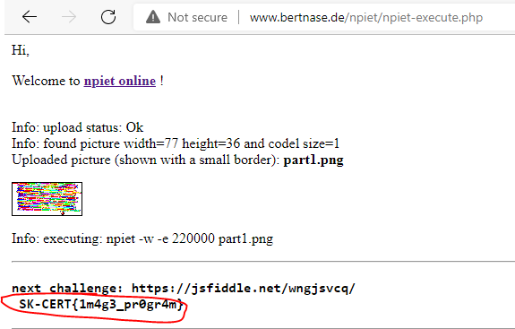
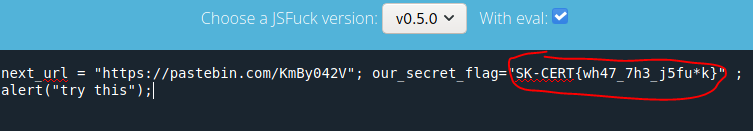
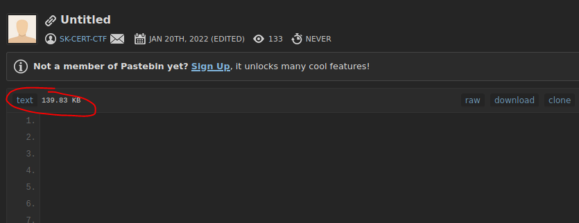
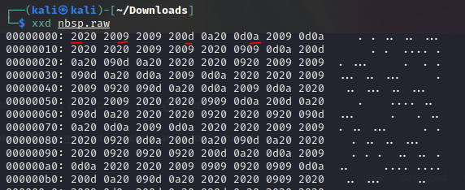
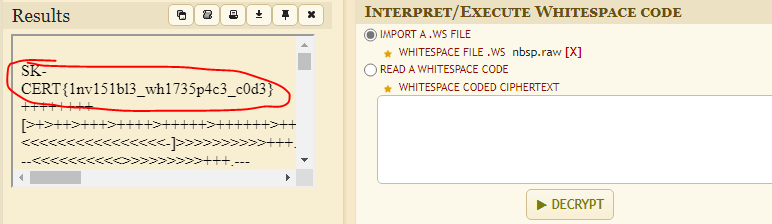
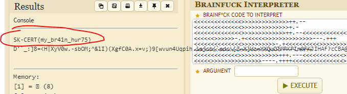
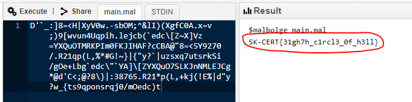

# SK-CERT - ESOLANG
> V rôznych programoch a v maléroch môžu byť ukryté kompilátory na veľmi nezvyčajné jazyky. Tato skupina jazykov sa volá Ezoterické programovacie jazyky, a tento scenár má za úlohu vás oboznámiť s ich existenciou a možno vám do budúcna uľahčiť ich detekciu v malvérovej analýze. Dáta potrebné pre scenár: https://drive.google.com/file/d/1WENWHp_HRx4bEwPXakGQ_rgUuVJj1NRW/view?usp=sharing <br/>
Reported Difficulty: 1

## 	Obrázkový kód
> Zdá sa vám na tomto obrázku niečo zvláštne?

Po trosku googlenia o ezoterickych kodoch, sa nam pozdavalo ze toto bude `piet` kod (http://www.bertnase.de/npiet/). Po uplodovani do http://www.bertnase.de/npiet/npiet-execute.php ziskavame flag



```
flag: SK-CERT{1m4g3_pr0gr4m}
```

## [][(![]+[])
> Ako je možné že tieto znaky javascript vykoná?

Toto je [JSFUCK](https://en.wikipedia.org/wiki/JSFuck), trosku to trvalo kym som natrafil na deobfuscator ktory to podporoval: https://enkhee-osiris.github.io/Decoder-JSFuck/.
Bolo treba zvolit JSFuck `v0.5.0` a zaskrtnut `With eval`:



```
flag: SK-CERT{wh47_7h3_j5fu*k}
```

## &nbsp;
> 

Obsah na pastebin sa pozdava byt prazdny ale vidime ze tam je velkost suboru ~140KB takze tam nieco non-printable je. 



Stiahneme si ten subor a pozrieme cez HEX editor, vidime tam hex code `20` (Space), `09` (Horizontal tab), `0d` (Carriage return) a `0a` (Line feed) co su vsetko non-printable znaky z ASCII tabulky.



Po nejakom case googlenie zistujeme ze je dalsi z ezoterickyck kodov - `Whitespace` - a nahazame aj dekoder na nasej vernej https://www.dcode.fr/whitespace-language. Po uploadovani suboru, mame flag a dalsiu ulohu:



```
flag: SK-CERT{1nv151bl3_wh1735p4c3_c0d3}
```

## ++>-]<---.<<
> Dávajte si pozor, aby vás z toho nerozbolel mozog

Dalsi z exemplarov je `Brainfuck` a hned pouzijeme decoder na https://www.dcode.fr/brainfuck-language:




```
flag: SK-CERT{my_br41n_hur75}
```

## Toto je peklo
> Posledná úloha v scenári, dúfame že ste si tento scenár užili

Z predchazajucej ulohy vysiel taky divny retazec nahodnych znakov, skusili sme vsetky dekodery na https://www.dcode.fr/tools-list#programming_language a ani jeden nepomohol. Google nas zaviedol na https://weekly-geekly.imtqy.com/articles/313334/index.html a skusame najst [dekompilator](https://www.tutorialspoint.com/execute_malbolge_online.php) na `Malbolge` (deviaty kruh Danteho pekla :))



```
flag: SK-CERT{31gh7h_c1rcl3_0f_h3ll}
```