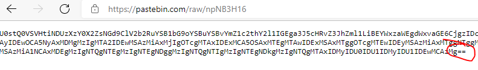
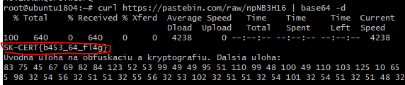
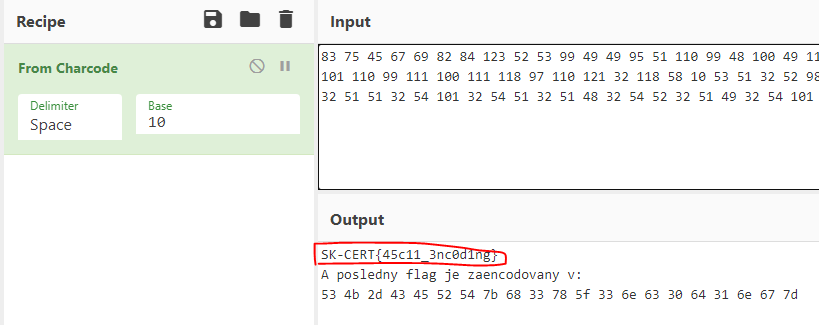
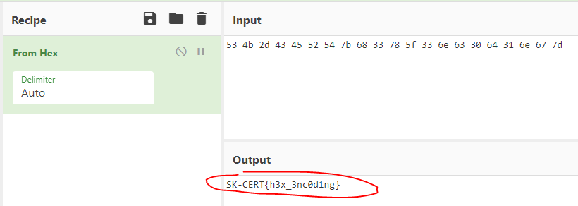

# SK-CERT - INITIAL: ENCODING
> Ako vstupný scenár do tejto témy sme zvolili encoding, aby ste sa oboznámili s rôznymi zápismi textu. Link: https://pastebin.com/npNB3H16 <br/>
Reported Difficulty: 0

:exclamation: *Súbory a zadania z tejto súťaže môžete stiahnuť z https://ulozto.net/file/9qLDe5asaCHJ/*

## 1 Prvá časť
> Jedná sa o jeden z najbežnejších enkódingov

> Body: 1

Vyzera to na base64 encoding:



Pouzieme Linux shell a dekodujeme `curl https://pastebin.com/raw/npNB3H16 | base64 -d`



```
flag: SK-CERT{b453_64_fl4g}
```

## 2 Druhá časť
> Base64 ste úspešne zvládli, zvládnete aj ďaľšiu výzvu?

> Body: 1

Dalsia cast enkodovania vyzera byt standardny ASCII kod, pozujeme CyberChef pre tuto ulohu:



```
flag: SK-CERT{45c11_3nc0d1ng}
```

## 3 Tretia časť
> Tak a touto úlohou prichádzame na záver INITIAL Scenáru. Držíme palce v hre!

> Body: 1

Posledna cast zda sa byt Hex kod:



```
flag: SK-CERT{h3x_3nc0d1ng}
```