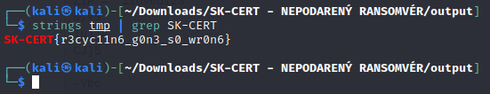

# SK-CERT - NEPODARENÝ RANSOMVÉR
> Známa skupina Fibonacci FIN rozšírila portfólio svojich služieb o ransomvér. Ransomvér má však našťastie detské chybičky… <br/>
Reported Difficulty: 3

:exclamation: *Súbory a zadania z tejto súťaže môžete stiahnuť z https://ulozto.net/file/9qLDe5asaCHJ/*

## 1 Neinicializovaný
> Už prvá iterácia ransomvéru používala silnú symetrickú šifru AES. Autori však pri implementácii vynechali dôležité úvodné kroky… Toto je súbor, zašifrovaný ransomvérom: https://drive.google.com/file/d/1a3GhrCgE2cgppE6CxZW_tw8z709al81j/view?usp=sharing

> Body: 9

:exclamation: *Ďalšie kroky boli pridané po súťaži na základe pomoci od iných súťažiacich ktorým patri vďaka!*

Z priloženého odkazu sťahujeme zip súbor v ktorom sa nachádza `flag.txt.encrypted` ktorý je zašifrovaný:


Zadanie hovorí, že bola požitá AES šifra ale že dôležité kroky boli vynechane, rozmýšľam aké by to mohli byt kroky... Poznám princíp AES ale nič hlbšie. Skúsime použiť známy CyberChef v ktorom nachádzame `AES Decrypt` ktorý vyžaduje zadať `Key` a `IV` a zvoliť `Mode`. 


Žeby tie vynechane doležíte kroky boli Key a IV? CyberChef žiada aby sme tam niečo vložili tak skúšame dať `0`... vyhodí to:


Tak skúsime tam dať 16 bajtový kľuč, teda 32 núl. Dáme to podobne aj do IV. Pri zvolenom default `CBC` móde to nič neukazuje, skúšame ďalšie a pri `CTR` móde máme krásne dešifrovaný flag:


```
flag: SK-CERT{00_z3r0_r4nd0mn355_0000}
```

P.S. v diskusii na diskorde bol uvedený aj ďalší spôsob ako toto dešifrovať pomocou `openssl enc -aes-256-ctr -K 0 -iv 0 -in flag.txt.encrypted`


## 2 Recyklácia
> Autori sa poučili a nastavili kvalitný kľúč a inicializačný vektor. Stále im však čosi nedocvaklo… Toto je obsah adresára, zašifrovaného ransomvérom: [link po sutazi nefunguje](#2-recyklácia)

> Body: 9

Z priloženého odkazu sťahujeme zip súbor v ktorom sa nachádzajú dva súbory `Strategia_kybernetickej_bezpecnosti_2021.pdf.encrypted` a `flag.txt.encrypted`. Slovo "recyklácia" nás navádza na situáciu znovu použitia rovnakého kľúča a inicializačného vektora pri šifrovaní. Z mojej limitovanej znalosti kryptografie, tuším že sa tato úloha da vyriešiť bez kľúča a IV, spomínam si že som také niečo kedysi čítal... tak ideme googliť a nachádzame tento link https://crypto.stackexchange.com/questions/2991/why-must-iv-key-pairs-not-be-reused-in-ctr-mode ktorý nám potvrdzuje že keď mame šifrovaný text C1 a k nemu prislúchajúci plaintext P1 a ďalší šifrovaný text C2 ktorý bol šifrovaný rovnakým kľúčom ako C1, tak na dešifrovanie C2 nepotrebujeme nič iné okrem C1, P1 a C2. Takže:
  * C1 = `Strategia_kybernetickej_bezpecnosti_2021.pdf.encrypted`
  * C2 = `flag.txt.encrypted`
  * P1 = plaintext zodpovedajúci `Strategia_kybernetickej_bezpecnosti_2021.pdf.encrypted`

To P1 skúsime pohľadať, mám pocit že to je nejaký verejný dokument... netrvalo viac ako zopár klikov a získavame P1: https://www.nbu.gov.sk/wp-content/uploads/kyberneticka-bezpecnost/Strategia_kybernetickej_bezpecnosti_2021.pdf

Teraz nám treba spraviť `C1 XOR P1 XOR C2`... ako toto spraviť jednoducho som sa inšpiroval týmto článkom: https://rmn0x01.github.io/2019/10/31/writeup-slashroot4-quals-reuse/. Nainštaloval som `pwn` package do Pythonu a dal do kopy tento `decode.py`:

```python
from pwn import *

c1 = open('Strategia_kybernetickej_bezpecnosti_2021.pdf.encrypted','rb').read()
p1 = open('Strategia_kybernetickej_bezpecnosti_2021.pdf','rb').read()
c2 = open('flag.txt.encrypted','rb').read()

p2 = xor(c2,xor(c1,p1))

k = open('tmp','wb+')
k.write(p2)
k.close()
```

Potom som vykonal script `python3 decode.py` a skúsil či je tam flag: `strings tmp | grep SK-CERT`



```
flag: SK-CERT{r3cyc11n6_g0n3_s0_wr0n6}
```

## 3 Tajomstvá
> Zákazníka skolila nová verzia ransomvéru. Zjavne už každý súbor šifruje inak. Tu sú nejaké vzorky.

> Body: 9

Po rozbalení zadania, máme 3 súbory:


Pri tejto úlohe je zaujímavá veľkosť šifrovaného a nešifrovaného súboru. Keď si pozrieme veľkosť súboru `nakupy.txt.ecrypted` je viac ako dvojnásobne nešifrovaného súboru `nakupy.txt`. Šifrovanie samotne nezvyšuje významne veľkosť dát, iba nepatrne kvôli paddingu takže táto viac ako dvojnásobná veľkosť znamená, že do šifrovaného súboru boli pripojene nejaké dáta navyše. Čo taká hypotéza, že sú to práve šifrovací kľuč a inicializačný vektor? Keď si pozrieme `nakupy.txt` tak ten má 32 bajtov (plaintext), šifrovací kľuč odhadneme na ďalších 32 bajtov (key) a IV na 16 bajtov čo vychádza presne na 80 bajtov, čomu sa rovná veľkosť `nakupy.txt.ecrypted`, takže hypotéza zatiaľ nebola vyvrátená. <br/>
Skúsme si pozrieť `nakupy.txt.ecrypted` v hex view a skúsime zvoliť prvých 32 bajtov ako zašifrovaný text, ďalších 32 ako kľuč a ostatných 16 ako IV:


Keď to dáme do CyberChefa máme úspešne dešifrovaný `nakupy.txt.ecrypted`:


Takže pozrieme sa na `flag.txt.encrypted`, či môžeme použiť rovnaký postup ako pri `nakupy.txt.encrypted` teda, použiť prvých 32 bajtov ako ciphertext, ďalších 32 ako key a posledných 16 ako IV:


Už pri prvom pohľade vidíme, že tam máme jeden bajt naviac ako v predchádzajúcom príklade, a keď použijeme rovnaký recept v CyberChefe tak nám to nedá očakávaný výsledok. Skúsime teda počítať odzadu: posledných 16 bajtov IV, potom 32 bajtov kľuč a prvých 33 bajtov ciphertext:


Vložíme nasledujúce údaje do CyberChef a získavame ďalší flag:


*Poznámka: Mode som skúšal rôzne a CTR zafungovalo v oboch prípadoch*

```
flag: SK-CERT{7h15_w45_0n1y_0bfu5c473d}
```

## 4 Vzory
> Novšia verzia ransomvéru nám zašifrovala jedinú kópiu nášho ascii-artu s flagom. Tentoraz je zjavne každý súbor zašifrovaný iným kľúčom, kľúč sa neukladá v súbore a ten správny ku ascii artu žiaľ nemáme k dispozícii. Z disku sme dokázali obnoviť len začiatok pôvodného ascii art súboru. Prikladáme zachránený začiatok a celý zašifrovaný súbor.

> Body: 9

## 5 Počítač do šrotu
> Pri riešení posledného ransomvérového incidentu skupiny Fibonacci Fin sme zažili kurióznu situáciu. Ransomvér zašifroval dva počítače s množstvom krátkych súborov. Jednalo sa o dve kópie tej istej databázy osôb. Z prvého sme vykopírovali všetky zašifrované súbory bez problémov. Druhý počítač haproval a občas sa sám od seba reštartoval, ale napokon sme dokázali zašifrované dáta vykopírovať aj z neho. Počítač zakrátko úplne prestal fungovať, pri štarte hlásil hardvérové chyby a musel ísť do servisu. Súbory z oboch počítačov prikladáme aj s príkladom jedného súboru, ktorý sme dokázali obnoviť zo zálohy.

> Body: 9

