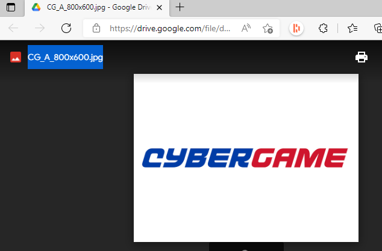
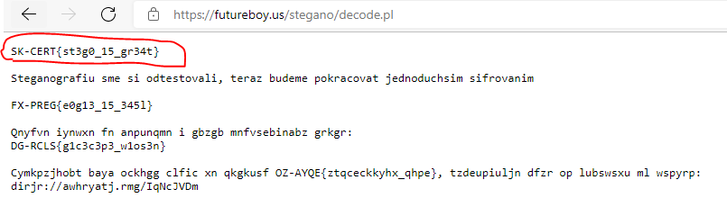
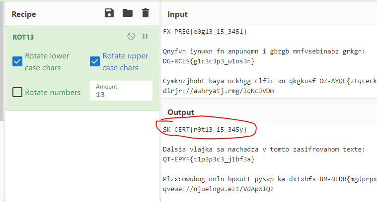
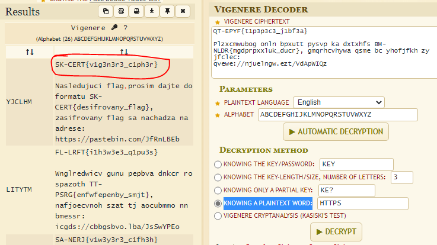
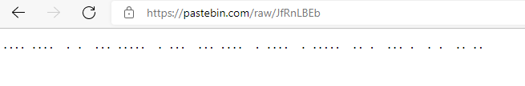
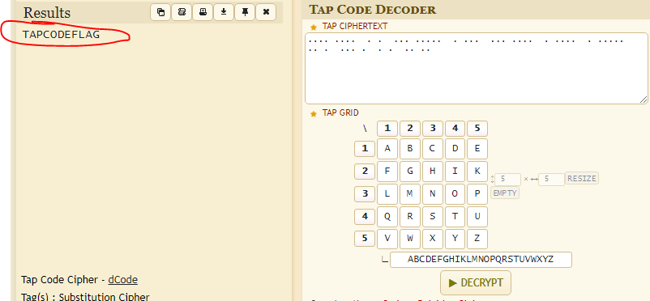

# SK-CERT - STEGOSTART
> Tento scenár vás ma oboznámiť so steganografiou a so šifrovaním, na ktoré môžete naraziť aj pri malvérovej analýze. Dáta potrebné pre scenár: https://drive.google.com/file/d/1PjoBjzu_nNKO3D8vzb9af8Wf6l4LKFf-/view?usp=sharing <br/>
Reported Difficulty: 2

## 1 Bežný obrázok?	
> Scenár sa začína analýzou tohto obrázku: linka

> Body: 6

Z linky stahujeme subor `CG_A_800x600.jpg`, ktory samozrejme na prvy pohlad vyzera normalne, ale vieme ze je tam nieco ukryte pomocou [steganografie](https://en.wikipedia.org/wiki/Steganography).



Skusame nejaky online stego decoder, a tento sa ukazal uzitocny https://futureboy.us/stegano/decinput.html. Pu uplodovani obrazku sa nam objavuje skrity kod: 



```
flag: SK-CERT{st3g0_15_gr34t}
```

## 2 Vieš čítať?
> Oboznámili ste sa so základnou steganografiou, a teraz sa oboznámime s nejakým tým šifrovaním.

> Body: 6

Pri zisteni sifrovania sme skusali niekolo roznych zakladnych receptov z CyberChef kym sme pouzili ROT13:



```
flag: SK-CERT{r0t13_15_345y}
```

## 3 Slabá šifra
> O krok bližšie k riešeniu

> Body: 6

Dalsi kod vyzera byt poliy-alphabetic cipher, pozname to podla toho ze rovnake pismeno paintextu ma ine pismeno v zakodovanom texte, napriklad `qvewe://njuelngw.ezt/VdApWIQz` vyzera byt URL adresa kde `qvewe://` ma byt `https://`. 
Tak s tymto zacneme dekovoanie, pouzijeme tento dekoder https://www.dcode.fr/vigenere-cipher a do `KNOWING A PLAINTEXT WORD:` vlozime `HTTPS` a ziskavame flag.



```
flag: SK-CERT{v1g3n3r3_c1ph3r}
```

## 4 What the Dot!?
> Naša posledná uloha v tomto scenári je nezvyčajna, ale aj napriek tomu že nie je moc používaná, bola pridaná pre zaujímavosť

> Body: 6

To co nahadzame na pastebine vyzera ako tap code cipher



Pouzijeme dekoder https://www.dcode.fr/tap-cipher a do tap gridu dame standardnu abecedu A->Z a stlacime decrypt:



```
flag: SK-CERT{TAPCODEFLAG}
```