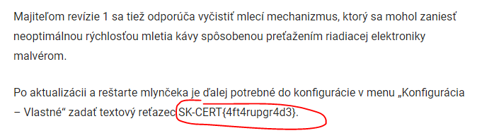

# SK-CERT - INITIAL APT 0XFF
> Objavila sa nová APT skupina, je potrebné zistiť kto sú <br/>
Reported Difficulty: 0

## 1 Nová APT Skupina
> Živé.sk publikovalo článok o odhalení novej APT skupiny (APT skupina Fibonacci FIN). Čo všetko viete zistiť o tejto APT skupine zo živé.sk

Vyhladame uvedeny clanok na [zive.sk](https://zive.aktuality.sk/clanok/fl21n24/nova-skupina-fibonacci-fin-utoci-na-siete-hotelov-monitoruje-svetovych-politikov/) a hladame `SK-CERT`:


```
flag: SK-CERT{r3c0nn41554nc3}
```

## 2 Druhá časť
> Zistite, či táto APT skupina napadla nejakú Slovenskú firmu.

Toto bolo dobre, mohlo to spustit hodiny vyhladavania na googly... a stacilo pozriet do komentov k clanku:


```
flag: SK-CERT{k4ff3b0t}
```

## 3 Odporúčania
> Dajte kaviarni odporúčania, čo urobiť. Živé.sk už na túto tému publikovala článok.

Kedze aj ja chcem taky mlyncek tak som hned zacal googlit :)


V dalsom clanku od [zive.sk](https://zive.aktuality.sk/clanok/9g5vm0v/kaviarne-v-ohrozeni-oblubeny-wi-fi-mlyncek-je-zranitelny-poradime-ako-neprist-o-oblubeny-napoj/) ziskavame posledny flag.



```
flag: SK-CERT{4ft4rupgr4d3}
```