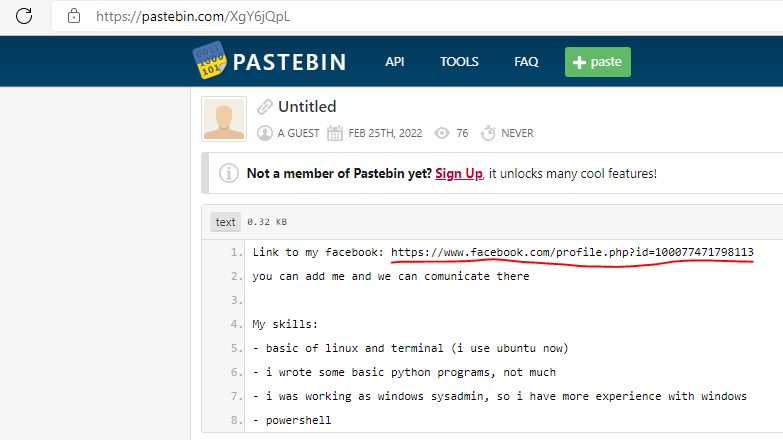

# SK-CERT - PREDAJ BOTNETU
> Z overeného zdroja sme dostali informáciu že zakladateľ botnetu “OctoBotDisaster” predal prístupy. Je potrebné zistiť kto daný botnet kúpil <br/>
Reported Difficulty: 1 

:exclamation: *Súbory a zadania z tejto súťaže môžete stiahnuť z https://ulozto.net/file/9qLDe5asaCHJ/*

## 1 Verejný zdroj
> Je potrebné nájsť informácie o danom botnete

> Body: 3

Google nic nedal, skusame Bing ktory nachadza GitHub repo: https://github.com/3mp7yv01d/OctoBotDisaster a mame prvy flag.


```
flag: SK-CERT{f1r57_fl4g}
```

## 2 Analýza zdroja	
> Je potrebné získať informácie z nájdeného zdroju

> Body: 3

Pozerame sa na bot.c a nic tam zaujimave nie je, nic nenaznacuje ze treba to kompilovat alebo hladat flag niekde v kode. Pozerame sa dalej na GitHub uzivatela `3mp7yv01d`, nema ziadne ine repo, vidime ale ze spravil 3 commity do `OctoBotDisaster`, pozrieme sa na commit history https://github.com/3mp7yv01d/OctoBotDisaster/tree/b9605c01205a7ae79883dcdff3e1a2dfef83ed04 a nachadzame dalsi flag:


```
flag: SK-CERT{574r71ng_w17h_051n7}
```

## 3 Discord
> Čo nového na discorde? Pokračujeme analýzou discordového serveru

> Body: 3

Z predchazajucej ulohy je aj link na discord server, pozrieme sa tam, dame vyhladavat "SK-CERT" a mame dalsi flag:


```
flag:SK-CERT{7r4n54c710n_c0mpl373}
```

## 4 Sociálna sieť
> Je tu ešte viac na zistenie?

> Body: 3

Na discorde si vyhladame usera `darkness#8770` a v jeho profile najdeme link na reddit:


Po otvoreni profilu v reddite mame dalsi flag:


```
flag: SK-CERT{w4y_t0_r3dd1t}
``` 

## 5 Zo siete na sieť
> Nikdy nepárujte svoju online identitu so svojou reálnou!

> Body: 3

Prehladavanie socialnych sieti pre uzivatela `d4rkne555` nic neprinieslo, zaujimave ze google query na `d4rkne555 site:linkedin.com` vrati podozrivy vysledok, ale ziadny flag to neprinieslo.


Viac krat som sa vracal na reddit a klikal na pastebin link od nasho hladaneho:


Ale link vracia `404`:


Viac krat som sa tu motal kym som si nevsilom ze `https://pastebin.com/Y3SiRUze` nie je ten link v texte `https://pastebin.com/XgY6jQpL`, a ze ten text bol editovany... po otvoreni spravneho pastebinu mame link na facebook profil:



A konence mame nasho kupujuceho:


```
flag: SK-CERT{h3nr1ch_r15z0rf3r}
```
