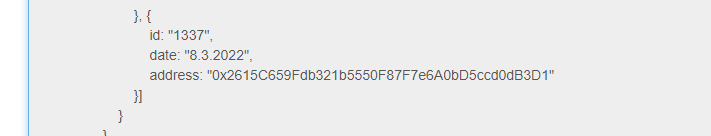
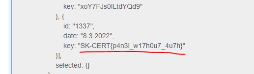

# SK-CERT - RANSOMVÉR
> Dostali sme hlásenie o napadnutí ransomvérom. Poškodená firma zaplatila požadovanú kryptomenu, no nedostali žiadny dešifrovací kľúč. Útočníci zanechali na počítači túto správu:
All your personal files has been encrypted with AES, which is a military grade encryption! The only way to get your files back is to pay some ETH to 0x2615C659Fdb321b5550F87F7e6A0bD5ccd0dB3D1
Your personal ID is 1337
You have 30 days to pay, when the time is up, your PC will be fully destroyed and all your data will be published on the Internet!
Best regards, Fibonacci FIN  
Reported Difficulty: 2

## 1 Informácie	
> Viete potvrdiť dodané informácie?

Zaciname s Google "Fibonacci FIN" co nas dovedie do clanku na [Zive](https://zive.aktuality.sk/clanok/fl21n24/nova-skupina-fibonacci-fin-utoci-na-siete-hotelov-monitoruje-svetovych-politikov/?msclkid=87c785bbc4c111eca23766f2fdbd4ade) co si ale uvedomujem ze je to z predchadzajucej lohy [SK-CERT - INITIAL: APT 0XFF](../SK-CERT%20-%20INITIAL%20APT%200XFF/SK-CERT%20-%20INITIAL%20APT%200XFF.md).

Dalej skusame hladat info o ETH adrese `0x2615C659Fdb321b5550F87F7e6A0bD5ccd0dB3D1` skusame rozne blockhain explorery (https://blockchair.com/, https://etherscan.io/), vidime tam dve transakcie jedna do a druha z adresy `0x2615C659Fdb321b5550F87F7e6A0bD5ccd0dB3D1` ale nam to nic nepomaha.

Dalej skusame Google dork `intext:0x2615C659Fdb321b5550F87F7e6A0bD5ccd0dB3D1` a jediny result nas zavedie na `https://malwaredecoder.com/result/5b411b2775a70f47cc1c7861676d29f1` kde nachadzame spomenute `ID 1337` spolu s spomenutou ETH adresou:

Vyzera to byt ako zdrojovy kod alebo dump ransomware panelu... pozerame este niszie a nachadzame nieco zaujimave `SK-CERT{p4n3l_w17h0u7_4u7h}`...ale nebol to prvy flag... sakra, neznasam ked najdem dalsi flag. Zeby to niekdo zo sutaziacich pouzil tento decoder a tak pomohol ostatnym... mozno. 

Asi musime najst ten panel niekde.

## 2 Prepojenie
> Zamknuté Informácie

## 3 Služba
> Zamknuté Prepojenie

## 4 Čo ďalej?
> Zamknuté Služba

## 5 Panel
> Zamknuté Čo ďalej?