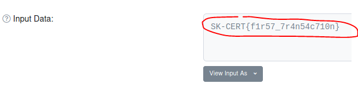
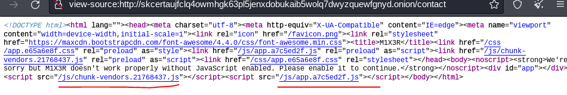

# SK-CERT - RANSOMVÉR
> Dostali sme hlásenie o napadnutí ransomvérom. Poškodená firma zaplatila požadovanú kryptomenu, no nedostali žiadny dešifrovací kľúč. Útočníci zanechali na počítači túto správu:
All your personal files has been encrypted with AES, which is a military grade encryption! The only way to get your files back is to pay some ETH to 0x2615C659Fdb321b5550F87F7e6A0bD5ccd0dB3D1
Your personal ID is 1337
You have 30 days to pay, when the time is up, your PC will be fully destroyed and all your dáta will be published on the Internet!
Best regards, Fibonacci FIN <br/>
Reported Difficulty: 2

:exclamation: *Súbory a zadania z tejto súťaže môžete stiahnuť z https://ulozto.net/file/9qLDe5asaCHJ/*

## 1 Informácie 
> Viete potvrdiť dodané informácie?

> Body: 6

Začíname s Google "Fibonacci FIN" čo nás dovedie do článku na [Zive](https://zive.aktuality.sk/clanok/fl21n24/nova-skupina-fibonacci-fin-utoci-na-siete-hotelov-monitoruje-svetovych-politikov/?msclkid=87c785bbc4c111eca23766f2fdbd4ade) čo si ale uvedomujem, že je to z predchádzajúcej úlohy [SK-CERT - INITIAL: APT 0XFF](../SK-CERT%20-%20INITIAL%20APT%200XFF/SK-CERT%20-%20INITIAL%20APT%200XFF.md).

Ďalej skúšame hľadať info o ETH adrese `0x2615C659Fdb321b5550F87F7e6A0bD5ccd0dB3D1` - skúšame rôzne blockhain explorery (https://blockchair.com/, https://etherscan.io/), vidíme tam dve transakcie jedna do, a druha z adresy `0x2615C659Fdb321b5550F87F7e6A0bD5ccd0dB3D1`, ale nám to nič nepomáha.

Ďalej skúšame Google dork `intext:0x2615C659Fdb321b5550F87F7e6A0bD5ccd0dB3D1` a jediný result nás zavedie na `https://malwaredecoder.com/result/5b411b2775a70f47cc1c7861676d29f1` kde nachádzame spomenuté `ID 1337` spolu s spomenutou ETH adresou:


Vyzerá to byť ako zdrojový kód alebo dump ransomware panelu... pozeráme ešte nižšie a nachádzame niečo zaujímavé `SK-CERT{p4n3l_w17h0u7_4u7h}`...ale nebol to prvý flag... neznášam keď nájdem ďalší flag. Žeby to niekto zo súťažiacich použil tento dekodér a tak pomohol ostatným... možno. 


Asi musíme nájsť ten panel niekde.

V tejto úlohe som v podstate skúšal dve veci:  a) hľadanie informácií o ransomware skupine "Fibonacci FIN" cez vyhľadávače a b) pozeraním ETH transakcii a adries. Pravé ta druha cesta viedla k odhaleniu prvého flagu. Pri skúmaní transakcii v súvislosti s adresou `0x2615C659Fdb321b5550F87F7e6A0bD5ccd0dB3D1` som sa pozrel na adresu [`0x8c5577a1e6c63c1e4d71cd6b3373bbb2777a55c7`](https://etherscan.io/address/0x8c5577a1e6c63c1e4d71cd6b3373bbb2777a55c7) odkiaľ bolo poslane `0.00822248 Ether` a, neviem ako mi to skôr ušlo, je tam hviezdička a informácia, že to môže by nejaká sprava:


Po kliknutí na [transakciu](https://etherscan.io/tx/0xd0cab6899d9e6fa946d2d030d053a495f48971b32c05030095b0c4044acd7ee6) pozrieme sa na `Input Data` field a vidíme tam nejaké dáta.  


Spomínam si, že som sa na to už par krát pozeral, ale keďže som noob tak som prehliadol, že je tam možnosť `View input As` a zvoliť `UTF-8` čo odhalilo prvý flag:



```
flag: SK-CERT{f1r57_7r4n54c710n}
```

## 2 Prepojenie
> Ešte, že je ten blockchain verejný. Čo sa stalo s peniazmi?

> Body: 6

Teraz keď už viem ako pozrieť dáta v `Input Data` field, pozrel som sa na odchádzajúcu [tansakciu](https://etherscan.io/tx/0x3d05580c1affaf8ddfbc99ef1d39452d63564c0c4c3cb30100b3b6b602b6df41) z adresy `0x2615c659fdb321b5550f87f7e6a0bd5ccd0db3d1` a zistil, že v `Input Data` field je [Thor URL](https://en.wikipedia.org/wiki/.onion): `skcertaujfclq4owmhgk63pl5jenxdobukaib5wolq7dwyzquewfgnyd.onion/#r0ck37m4573r`


Po otvorení adresy v [Thor Browser](https://www.torproject.org/download/) získavame ďalší flag:


```
flag: SK-CERT{0n10n_d0m41n}
```

## 3 Služba
> Vyzerá to na nejaký hidden service, aké informácie viete zo stránky získat?

> Body: 6

Pozerám, čo na tej stránke všetko je, píše tam `you can contact us on our forum on this website` ale na `Contact Us` page nie je žiadny forum, iba contact info:


Najprv sa pozrieme na source code stánky a vidíme tam dva zaujímavé JavaScript súbory:



Prvý `chunk-vendors.21768437.js` sa zdá byť nejaký štandardný bundle kód z VUE.js. Pozrieme sa na ten druhy a ten je podstatne zaujímavejší, vyzerá, že je to ten spomínaný forum a je tam aj náš flag:


Skúšame či ten forum je dostupný cez `/forum` a máme náš flag v plnej krase:


```
flag: SK-CERT{br0k3n_m1x3r}
```

## 4 Čo ďalej?
> Daný hidden service vypol fórum, aby sa ľudia nemohli ďalej sťažovať. Čo teraz?

> Body: 6

Pri ďalšom pátraní som sa pozrel na každú ETH adresu uvedenú vo forume, zaujímavá bola adresa `0x456642fC0CEb49B6a2E975695978147b51BE6597` od `r0ck37m4573r`:


Na tej [adrese](https://etherscan.io/address/0x456642fC0CEb49B6a2E975695978147b51BE6597#comments) v komentároch nachádzame ďalší flag:


```
flag: SK-CERT{cryp70_c0mm3n7}
```

## 5 Panel
> Aké informácie viete získať z kontrolného panelu útočníka?

> Body: 6

Z predchádzajúcej úlohy máme aj URL na `control panel` ktorý som hľadal už v prvej úlohe. Trošku ma mrzí, že posledný flag som našiel už v prvej úlohe.. ale skúsim ho nájsť aj oficiálnou cestou.

Otváram control panel na `int3.sk/rans/panel/` a kochám sa jeho krásou:


Nič zaujímavé na `Home`, skúšame `View`, ktorý obsahuje iba prázdnu stránku.


Pohlaď na `Page Source` nám odhaľuje zaujímavý JavaScript v ktorom nachádzame posledný flag:


Trošku som sklamaný, že posledný flag nebol viac náročnejší.

```
flag: SK-CERT{p4n3l_w17h0u7_4u7h}
```

