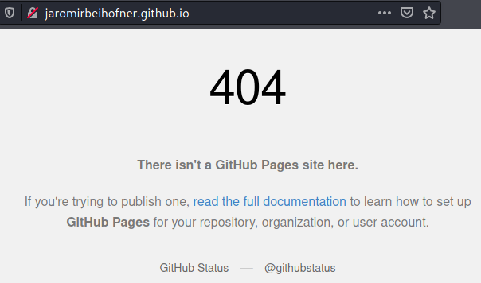
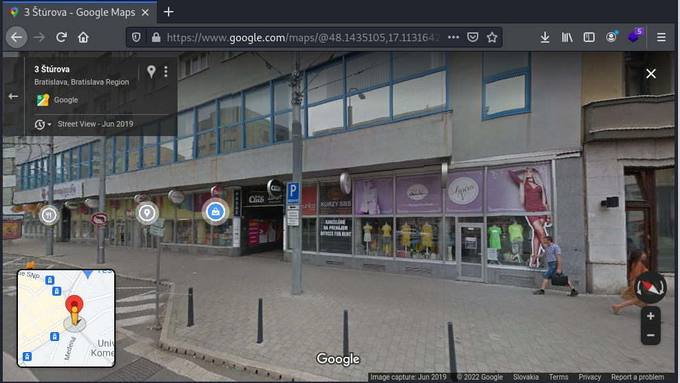
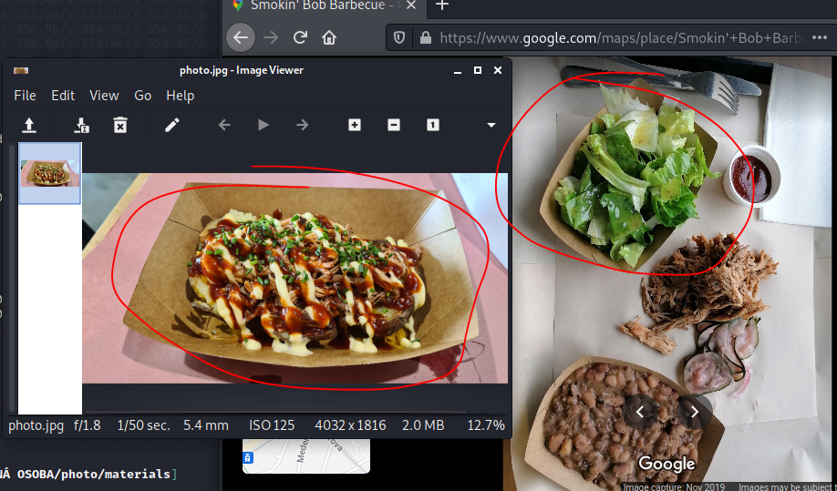

# SK-CERT - STRATENÁ OSOBA
> Jaromir Beihofner sa začiatkom marca stratil. Je potrebné zistiť, kde sa nachádzal naposledy. <br/>
Reported Difficulty: 3

## 1 Kto som?
> Kto vlastne je Jaromir Beihofner

> Body: 9

Ah.. neznášam keď musím zakladať Facebook profil...našťastie je prvý flag verejný.


```
flag: SK-CERT{50_7h15_15_m3}
```

## 2 Cestopis
> Jaromir sa rád podelil o svoje cestovatelské zážitky

> Body: 9

Predpokladám, že tu treba nájsť Jaromirovu stránku ci blog. Skúšal som rôzne Google query a web.archive.org ale sa mi nepodarilo. Pri prezeraní Facebook profilu vidíme odkaz na `jaromirbeihofner.github.io`


Ale URL vracia `404`:



Skúsime sa pozrieť či `jaromirbeihofner.github.io` je vo web.archive a bingo: https://web.archive.org/web/20220225082855/https://jaromirbeihofner.github.io/


```
flag: SK-CERT{4rch1v3_0rg_15_5tr0ng}
```

## 3 Archív
> Čo všetko vieme získať zo stránky?

> Body: 9

Z archívu stránky sú zaujímavé informácie o zrušení stránky z dna 25.02.2022:


Potom informácia, že plánuje cestovať do Tatier začiatkom marca:


A zaujímavý článok, kde spomína bistro, ktoré ponuka BBQ špeciality, ktoré si odfotil a fotku uložil do zaheslovaného rar:


Sťahujeme súbor z https://drive.google.com/file/d/1hWS-NOx5LnVoucMi534X4U6oDHrl2mp0/view, `John the Ripper` beží už pol dňa a nič...

Skúšam medzitým Google query `bistro barbecue špeciality` a pozerám prvý výsledok `Smokin' Bob Barbeuce` a v komentároch čo nevidím... náš Jaromir tam prispel:


Bohužiaľ ten flag nesedel na 3. úlohu, predpokladám, že je to flag pre ďalšiu.

Pokračujeme s hádaním hesla... `John the Ripper` skončil full `rockyou.txt` wordlist a nič. Skúšal som aj kombinovať informácie z Facebook profilu ako dátum narodenia a iné:

```
04.05.1980
4.5.1980
4Maj1980
4maj1980
maj1980
Maj1980
Jaromir1980
Jaromir80
4 May 1980
hawk
```

Po dlhom váhaní som sa rozhodol vyžiť nápovedu. Prvý HINT obsahoval: "na mieru prispôsobený wordlist" čo mi, ako som predpokladal, moc nepomohlo. Zobral som aj druhu, ktorá znela niečo ako "na mieru prispôsobený wordlist z informácií obsiahnutých na Jaromirovom Facebook profile" čo mi už bolo užitočne a potvrdilo, že som bol na správnej ceste keď som kombinoval informácie ako dátum narodenia a že musím v tom ešte vytrvať... a po niekoľkých pokusoch som uhádol heslo `Hawk1980`... keď sa spätne pozriem, bol som veľmi blízko, ale bez druhej nápovedy by som pravdepodobne odbočil inde a možno nikdy heslo ani neuhádol.

Takže, po otvorení rar súboru mame `flag.txt` a `photo.jpg`:


Otvárame `flag.txt` a konečne:


```
flag: SK-CERT{r4r_p455w0rd_cr4ck3d}
```

## 4 Obľúbené miesto
> Jaromir zdieľal fotku chutného jedla, vieme zistiť o tejto fotke viacej?

> Body: 9

Aj keď som flag pre tuto úlohu našiel už v predchádzajúcej úlohe, ideme skúsiť cestu ktorú pre nás tvorcovia učili.
Otvárame `photo.jpg` z rar súboru a skúšame Google Image Search. Tento nám moc nepomohol, žiadny konkrétny bistro ako by som očakával. 


Skúšame inou cestou, pozeráme sa na vlastnosti fotky a mame šťastie, sú tam všetky properties vrátane GPS súradníc. 


Trosku sa trápim s kopírovaním súradníc do Google Maps, hľadám v akom formáte treba vložiť súradnice do Googla a nachádzam v [návode](https://support.google.com/maps/answer/18539?hl=en&co=GENIE.Platform%3DDesktop) možnosť `Degrees, minutes, and seconds (DMS): 41°24'12.2"N 2°10'26.5"E`. Nepáči sa mi ako to je zobrazene vo Windows file properties tak použijem `exiftool` na Linuxe kde mám možnosť [špecifikovať formát](https://exiftool.org/forum/index.php?topic=6246.0): `exiftool photo.jpg -c "%d°%d'%.2f"`


Vložením týchto súradníc do Google Maps, máme presnú polohu hľadaného miesta:


Žiadne bistro ale tam nie je, skúšame Street View:



Zo Street View vidíme, že je to ulica `Štúrova 3` ale žiadny bistro tam nie je... je tam nejaká obchodná pasáž

Vraciame sa ma Map View a klikáme na "Restaurants" a objavuje sa `Smokin' Bob Barbecue`:


Pri prezeraní fotiek si všímame, že Street View nemá celkom aktuálne snímky a že bistro tam nebolo vidno:


Tiež vidíme, že papierové taniere, ktoré vidíme na Google Images sú rovnaké ako fotka jedla or Jaromira.



Podlá týchto informácií môžeme usúdiť, že Jaromir bol v `Smokin' Bob Barbecue` a odfotil si to jedlo. Žiadny ale flag ešte nemáme, a ako to býva v týchto súťažiach, nesmieme zabudnúť precitať si komentáre, tak na záver sa pozrieme do hodnotení a nachádzame tam náš flag:


```
flag: SK-CERT{pr377y_4w3s0m3_bbq}
```

## 5 Posledné miesto
> Je potrebné zistiť kde sa jaromir nachádzal naposledy.

> Body: 9

*K write-up tejto úlohy dodal poznámky súťažiaci ktorý chcel zostať anonymný. Vďaka!*

Riešenie poslednej úlohy sa nachádza v príspevku https://www.reddit.com/user/Winter-Eye5522/comments/t3pwvx/prekr%C3%A1sne_tatry_po_skcertpr377y_4w3s0m3_bbq/. Podlá mňa, zámer bol nájsť tento príspevok iba ak niekto dal do vyhľadávača flag z predchádzajúcej úlohy, ináč podlá ostatných kľúčových slov to bolo skoro nemožne.


Query ktorá nájde tento príspevok je "tatry bbq" priamo v reddit sarchboxe:


Po otvorení príspevku vidíme, že Jaromír postol link na fotku:


Otvárame fotku a vidíme krásne Tatry, ale žiadny flag:


Tak ako v predchádzajúcej úlohe, pozrieme na EXIF data v ktorých je ukrytý posledný flag:


```
flag: SK-CERT{77ry}
```


